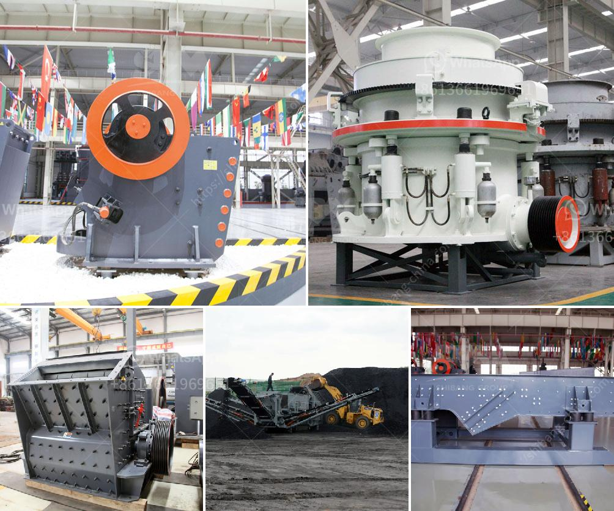

<h3>marine diamond mining equipment</h3>
Diamonds have fascinated humanity for centuries, captivating us with their dazzling brilliance and undeniable allure. While traditionally mined on land, the quest for these precious gemstones has now extended beneath the ocean's surface. Marine diamond mining, also known as deep-sea diamond mining, is a revolutionary endeavor that combines advanced technology, engineering marvels, and environmental considerations.

As the accessibility of diamonds on land starts to dwindle, mining companies have turned their attention to the ocean floor. The wealth of untapped resources lies beneath vast expanses of water, presenting new challenges and opportunities for the diamond industry. In order to extract diamonds from the sea, specialized marine diamond mining equipment is essential.

One of the primary pieces of equipment used in marine diamond mining is the offshore mining vessel. These enormous ships are specially designed to operate in deep waters, equipped with cutting-edge technology to ensure efficient and safe extraction. These vessels have dynamic positioning systems that utilize satellite navigation to maintain a stable position above the mining area, allowing precise control over operations.

To recover the diamond-bearing sediment from the seabed, specialized mining tools are used. Among them, the most commonly used equipment is the crawler. Crawlers are essentially underwater tractors equipped with giant vacuum hoses, suctioning the diamond-rich sediment from the ocean floor. These crawler systems can operate at considerable depths, using a combination of hydraulic power and mechanical strength to collect the sediment in a controlled manner.

Once the sediments are extracted, they are transported to the surface for processing. Sophisticated diamond recovery ships are equipped with advanced processing plants that are capable of separating the diamonds from other minerals and debris. These processing plants use a combination of techniques, including screening, gravity separation, and X-ray fluorescence to identify and retrieve the valuable diamonds. The recovered diamonds are then securely stored on-board until the vessel returns to port.

Marine diamond mining equipment also incorporates sophisticated safety features to minimize environmental impact. Careful consideration is given to protect the delicate marine ecosystem and minimize disturbances to aquatic life. Operators of the mining vessels adhere to strict regulations and guidelines to ensure responsible mining practices, including the use of environmentally friendly lubricants, proper waste disposal, and the monitoring of water quality.

While marine diamond mining presents exciting opportunities, it also poses unique challenges. Working in remote, harsh underwater environments is incredibly demanding. Limited visibility, extreme pressures, and unpredictable weather conditions make operations more complex. Additionally, the costs associated with marine mining can be substantial, including initial investment, maintenance, and the need for highly skilled personnel.

Marine diamond mining equipment represents a paradigm shift in diamond mining. The discovery and successful extraction of precious gems beneath the ocean's surface underscore the limitless nature of human ingenuity. However, it is crucial to ensure that marine mining is conducted responsibly, prioritizing environmental preservation and sustainability.

As technology and research continue to advance, the marine diamond mining industry holds immense potential for the future. As we explore and unlock the treasure troves hidden beneath the waves, ongoing innovation will undoubtedly lead to new discoveries and advancements in this incredible frontier of diamond mining.
<h3>Contact us</h3><ul><li><strong>Whatsapp:&nbsp;<a href="https://wa.me/8613661969651">+8613661969651</a></strong></li><li><a href="https://swt.shibang-china.com/?git&amp;zhl&amp;marine diamond mining equipment"><strong>Online Service(chat now)</strong></a></li></ul><h3>Related</h3><ul><li><a href='price hammer mill capacity of made in china.md'>price hammer mill capacity of made in china</a></li><li><a href='gravel crushing equipment.md'>gravel crushing equipment</a></li><li><a href='belt price conveyor belt price malaysia.md'>belt price conveyor belt price malaysia</a></li><li><a href='jaw crusher typex.md'>jaw crusher typex</a></li><li><a href='dolomite crusher manufacturer in usa.md'>dolomite crusher manufacturer in usa</a></li></ul>