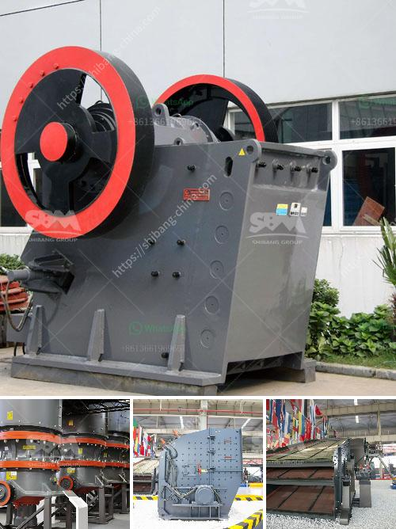

<h3>material of conveyor belts</h3>
Conveyor belts are a critical component in various industries, enabling the efficient movement of materials and products from one point to another. These belts are made from different materials, each offering its unique set of characteristics and advantages. In this article, we will explore some popular materials used in the manufacturing of conveyor belts.

One commonly used material for conveyor belts is rubber. Rubber belts are versatile, easy to handle, and have excellent resistance to wear and tear. They are ideal for transporting materials in industries such as mining, agriculture, and food processing. Rubber belts can withstand high temperatures and can be customized to handle different types of materials, ensuring smooth transportation throughout the production process.

Another material commonly used for conveyor belts is PVC (Polyvinyl chloride). PVC belts are lightweight, flexible, and have excellent resistance to chemicals and abrasion. They are widely used in industries like logistics, airports, and packaging. PVC belts are also known for their low maintenance requirements and cost-effectiveness, making them a popular choice for companies looking to optimize their production processes.

For heavy-duty applications where robustness and durability are paramount, steel cord belts are the preferred choice. These belts are constructed with steel cords embedded in the rubber, providing exceptional strength and tear resistance. Steel cord belts are commonly used in industries such as mining, steel production, and cement manufacturing. They can withstand high tensions and heavy loads, ensuring the transportation of bulk materials over long distances.

In certain specialized industries, such as food and pharmaceuticals, conveyor belts must meet strict hygiene standards. For these applications, materials like stainless steel or food-grade plastic are used. Stainless steel belts are corrosion-resistant and can withstand high temperatures, making them suitable for industries with high sanitation requirements. Food-grade plastic belts, on the other hand, are lightweight, easy to clean, and resistant to chemicals, oils, and grease. These characteristics make them ideal for conveying food products safely and hygienically.

In recent years, there has been an increased focus on sustainability and environmental impact. As a result, conveyor belts made from recycled materials, such as PET (Polyethylene terephthalate), have gained popularity. PET belts offer excellent tensile strength, impact resistance, and dimensional stability. By using recycled materials, companies can reduce their carbon footprint and contribute to a circular economy.

In conclusion, conveyor belts play a crucial role in many industries, facilitating the movement of materials and products efficiently. The selection of the appropriate belt material depends on factors such as the application, industry requirements, and specific operational needs. Whether it is rubber, PVC, steel, stainless steel, food-grade plastic, or recycled materials, each material offers distinctive properties that make it suitable for various applications. Consideration of these factors is essential to ensure the smooth and efficient operation of conveyor systems, ultimately contributing to increased productivity and profitability for businesses.
<h3>Contact us</h3><ul><li><strong>Whatsapp:&nbsp;<a href="https://wa.me/8613661969651">+8613661969651</a></strong></li><li><a href="https://swt.shibang-china.com/?git&amp;zhl&amp;material of conveyor belts"><strong>Online Service(chat now)</strong></a></li></ul><h3>Related</h3><ul><li><a href='calcium carbonate plant industry.md'>calcium carbonate plant industry</a></li><li><a href='india sand crusher.md'>india sand crusher</a></li><li><a href='diamond stone crusher price list.md'>diamond stone crusher price list</a></li><li><a href='coal wash plant for sale in malaysia.md'>coal wash plant for sale in malaysia</a></li><li><a href='coal crusher types.md'>coal crusher types</a></li></ul>