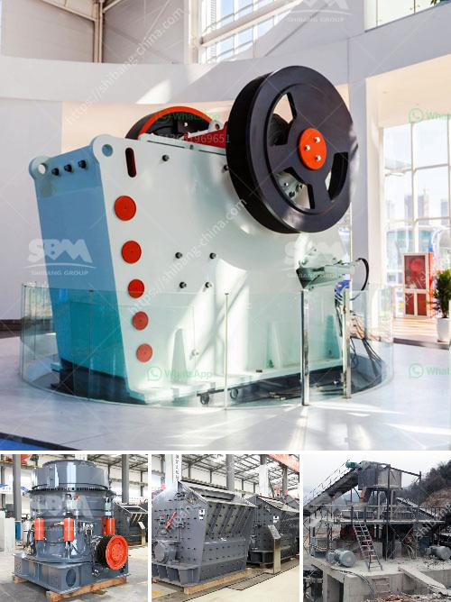

<h3>metal detector for iron ore crushing plant</h3>
Metal detectors are devices designed to detect and distinguish various types of metals within an object or in the surrounding environment. They play a vital role in enhancing the safety and efficiency of industrial processes, particularly in the mining industry. In iron ore crushing plants, metal detectors are used to detect any metallic objects that may be entrapped within the crushed ore.

During the mining process, metal parts in the mined material, such as ore fragments, bolts, nuts, and tools, can be extremely hazardous to crushers. While moving crushers typically encounter large quantities of tramp metal—some of which could be dangerous—magnetic separators are used alongside metal detectors to detect and remove any metal contaminants before further processing.

Many iron ore crushing plants use metal detectors to detect the presence of tramp metal in their ore. Metal detectors come in various sizes and designs, and different industries have different requirements, hence, the choice of detector will vary. Depending on the application, metal detectors can be designed as a standalone unit, or they can be integrated into the crushing plant's control system.

When a metal object is detected, the metal detector sends a signal to the control system or the crusher's operator. This allows them to take quick action to prevent damage to the crushers and avoid downtime. By using metal detectors, iron ore crushing plants can identify and react to any metal that may be present in the material, ensuring that no valuable material is lost and the production process remains efficient.

Metal detectors for iron ore crushing plants are specifically designed to protect crushers from various types of metal objects, as these can cause extensive damage to the machinery. The advanced technology and high sensitivity of modern metal detectors ensure that iron ore crushing plants are protected against any potential threats posed by unwanted metal objects.

In conclusion, metal detectors play a crucial role in iron ore crushing plants by detecting and removing any metallic objects that may cause damage to the crushers or disrupt the production process. These detectors are essential for ensuring the safety and efficiency of the crushing plants, preventing any accidents or disruptions that could result in significant economic losses. Iron ore crushing plants that utilize metal detectors can guarantee the integrity of their operations and maximize the value of their investments.
<h3>Contact us</h3><ul><li><strong>Whatsapp:&nbsp;<a href="https://wa.me/8613661969651">+8613661969651</a></strong></li><li><a href="https://swt.shibang-china.com/?git&amp;zhl&amp;metal detector for iron ore crushing plant"><strong>Online Service(chat now)</strong></a></li></ul><h3>Related</h3><ul><li><a href='italia dry mortar production line supplier.md'>italia dry mortar production line supplier</a></li><li><a href='prices for sand washer on sale in india.md'>prices for sand washer on sale in india</a></li><li><a href='double roll rollers.md'>double roll rollers</a></li><li><a href='ball mill using industry.md'>ball mill using industry</a></li><li><a href='m sand crusher in district.md'>m sand crusher in district</a></li></ul>