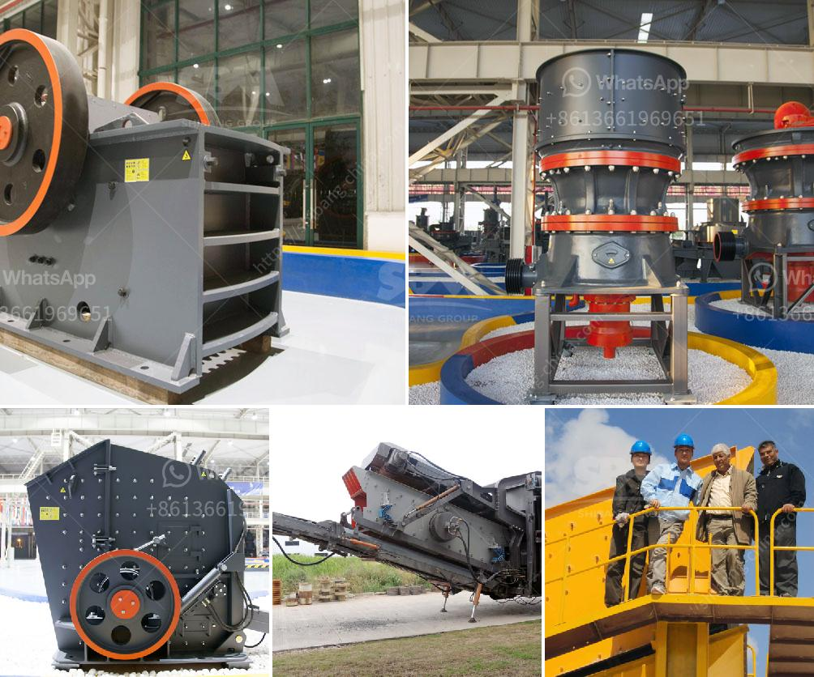

<h3>metal pulverizer crusher suppliers</h3>
Metal pulverizers are essential equipment in many industries, particularly in the recycling and waste management sectors. These crushers play a crucial role in reducing large metal objects into smaller, more manageable pieces, making it easier to process and recycle them.

To ensure that businesses have access to high-quality metal pulverizer crushers, it is crucial to source them from reliable and reputable suppliers. These suppliers specialize in manufacturing and distributing top-of-the-line pulverizer crushers designed to withstand the rigorous demands of industrial applications.

One key feature to look for in a metal pulverizer crusher supplier is their expertise and experience in the industry. The best suppliers have a deep understanding of the specific needs and challenges faced by businesses in various sectors. They have perfected their crusher designs to maximize efficiency and ensure consistent performance.

Moreover, reputable suppliers invest in state-of-the-art technology and use high-grade materials to manufacture their crushers. This guarantees their durability, longevity, and ability to withstand heavy-duty applications. These crushers should also be equipped with advanced safety features to protect operators and ensure smooth operations.

Another important aspect of a reliable metal pulverizer crusher supplier is their commitment to customer satisfaction. They should offer comprehensive customer support, including installation assistance, maintenance services, and spare part availability. A supplier that is readily available to address any concerns or issues that arise demonstrates their dedication to client success.

Furthermore, a good supplier should also prioritize sustainability. They should focus on designing crushers that are energy-efficient and have low environmental impact. By promoting sustainable manufacturing practices, these suppliers contribute to a cleaner and greener future.

In conclusion, choosing the right metal pulverizer crusher supplier is essential for businesses in need of this equipment. The supplier's expertise, quality of materials and design, commitment to customer satisfaction, and focus on sustainability are key factors to consider. By partnering with a reliable supplier, businesses can ensure that their metal pulverizer crushers will perform optimally and efficiently for years to come.
<h3>Contact us</h3><ul><li><strong>Whatsapp:&nbsp;<a href="https://wa.me/8613661969651">+8613661969651</a></strong></li><li><a href="https://swt.shibang-china.com/?git&amp;zhl&amp;metal pulverizer crusher suppliers"><strong>Online Service(chat now)</strong></a></li></ul><h3>Related</h3><ul><li><a href='jaw crusher machine in dubai.md'>jaw crusher machine in dubai</a></li><li><a href='marble powder 100 mesh grinding machine.md'>marble powder 100 mesh grinding machine</a></li><li><a href='m sand crusher in district.md'>m sand crusher in district</a></li><li><a href='plant machinery manufacturers in germany.md'>plant machinery manufacturers in germany</a></li><li><a href='sand washing machine saudi.md'>sand washing machine saudi</a></li></ul>