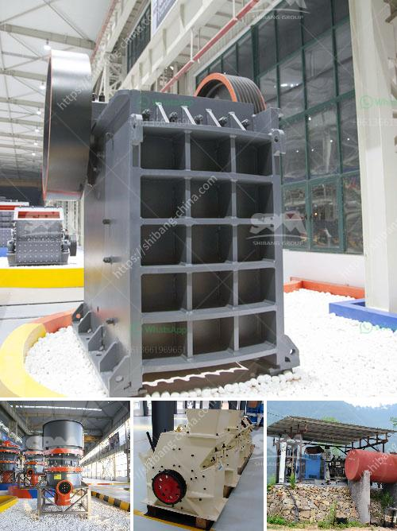

<h3>method statement of installation conveyor belt</h3>
Conveyor belts are widely used in industries for transportation of heavy and bulky materials efficiently. They provide a reliable and safe means of transport for materials such as coal, ores, grains, and other products. The installation of a conveyor belt requires careful planning and preparation to ensure it is done correctly and safely. This article will outline the method statement for the installation of a conveyor belt.

1. Preparing the site: Before commencing with the installation process, the site needs to be prepared. All obstructions, debris, and tripping hazards should be removed from the area where the conveyor belt will be installed. Adequate lighting should be provided to ensure visibility during the installation process.

2. Assembling components: The various components of the conveyor belt, such as the frame, rollers, and belt, need to be properly assembled. The frame should be securely bolted to the floor or foundation to provide a stable base for the conveyor belt. The rollers should be attached to the frame, ensuring they are aligned and level.

3. Positioning the belt: The belt needs to be positioned correctly on the conveyor system. Care should be taken to ensure that the belt is properly aligned and tensioned. A tensioning device should be used to adjust the tension of the belt to the appropriate level. This will prevent slippage and ensure smooth operation of the conveyor belt.

4. Connecting electrical parts: If the conveyor belt is motorized, electrical connections need to be made. This includes connecting the motor, control panel, and sensors. All electrical connections should be done following the relevant safety guidelines and regulations. Proper grounding should be provided to prevent electrical hazards.

5. Testing and commissioning: Once the installation is complete, the conveyor belt should be tested and commissioned. This involves running the belt at different speeds and checking for any abnormalities or irregularities. All safety features, such as emergency stops and conveyor belt tracking systems, should be tested to ensure their proper functioning.

6. Training and documentation: Before handing over the conveyor belt to the client, proper training should be provided to the operators. They should be trained on how to operate the conveyor belt safely and efficiently. Additionally, all installation and maintenance procedures should be documented for future reference.

In conclusion, the installation of a conveyor belt requires careful planning and adherence to safety guidelines. By following the method statement outlined above, the installation process can be carried out efficiently and safely. Proper installation and maintenance of the conveyor belt will ensure its long-term reliability and performance.
<h3>Contact us</h3><ul><li><strong>Whatsapp:&nbsp;<a href="https://wa.me/8613661969651">+8613661969651</a></strong></li><li><a href="https://swt.shibang-china.com/?git&amp;zhl&amp;method statement of installation conveyor belt"><strong>Online Service(chat now)</strong></a></li></ul><h3>Related</h3><ul><li><a href='ore crusher mining equipment business plan.md'>ore crusher mining equipment business plan</a></li><li><a href='vibrating screen price.md'>vibrating screen price</a></li><li><a href='small scale gold mining plant in zimbabwe.md'>small scale gold mining plant in zimbabwe</a></li><li><a href='list of crushers companies in malaysia.md'>list of crushers companies in malaysia</a></li><li><a href='cebu supplier of disposable jaw crusher.md'>cebu supplier of disposable jaw crusher</a></li></ul>