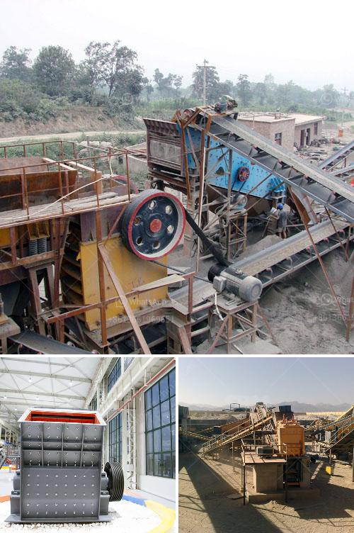

<h3>mica powder making</h3>
Mica powder, a versatile and shiny mineral-based product, has gained popularity for its wide range of applications. From cosmetics to arts and crafts, mica powder is used to add luster, sparkle, and shimmer to various products. This article explores the process of making mica powder, highlighting its usage, benefits, and environmental implications.

Mica, a naturally occurring crystalline mineral, is carefully extracted from mines in various parts of the world. The mineral is then grounded into fine particles to create mica powder. The grinding process involves crushing and pulverizing the mica flakes into a fine powder, giving it a smooth and silky texture.

There are different types of mica powder available in the market, such as colored mica powder, which is achieved by adding pigments or dyes during the grinding process. This allows manufacturers to create a wide range of vibrant and eye-catching colors to cater to different industries and consumer preferences.

One of the main uses of mica powder is in the cosmetics industry. It is a popular ingredient in various makeup products, including eyeshadows, blushes, and lipsticks, due to its ability to add a shimmering effect and enhance the overall appearance. Mica powder is also a common ingredient in bath bombs, soaps, and body glitters, providing a luxurious and sparkly experience.

Aside from its cosmetic applications, mica powder is also used in other industries. In arts and crafts, it is used to add a dazzling effect to paintings, resin crafts, and pottery. Additionally, mica powder is utilized in the automotive and electronics industries as a coating material, providing resistance to heat, electricity, and UV radiation.

However, the manufacturing process of mica powder raises environmental concerns. Mining activities can have adverse effects on the surrounding ecosystems, leading to deforestation, habitat loss, and soil erosion. In addition, the extraction process may use excessive energy and water resources, contributing to carbon emissions and water pollution.

To address these concerns, it is crucial for manufacturers to adopt sustainable and responsible practices in mica mining and processing. This includes implementing proper waste management systems, reducing energy consumption, and promoting reforestation efforts.

In conclusion, mica powder is a versatile and visually appealing product that finds its use in various industries. Whether for cosmetics or arts and crafts, mica powder adds a touch of glamour to everyday products. However, it is important for manufacturers to prioritize sustainability and minimize the environmental impact associated with mica mining and production.
<h3>Contact us</h3><ul><li><strong>Whatsapp:&nbsp;<a href="https://wa.me/8613661969651">+8613661969651</a></strong></li><li><a href="https://swt.shibang-china.com/?git&amp;zhl&amp;mica powder making"><strong>Online Service(chat now)</strong></a></li></ul><h3>Related</h3><ul><li><a href='the gold mining process in zimbabwe.md'>the gold mining process in zimbabwe</a></li><li><a href='iron processing plant cost.md'>iron processing plant cost</a></li><li><a href='crusher machine for mineral powder.md'>crusher machine for mineral powder</a></li><li><a href='cost of conveyor belts.md'>cost of conveyor belts</a></li><li><a href='chrome ore ferro chrome plant construction plants.md'>chrome ore ferro chrome plant construction plants</a></li></ul>