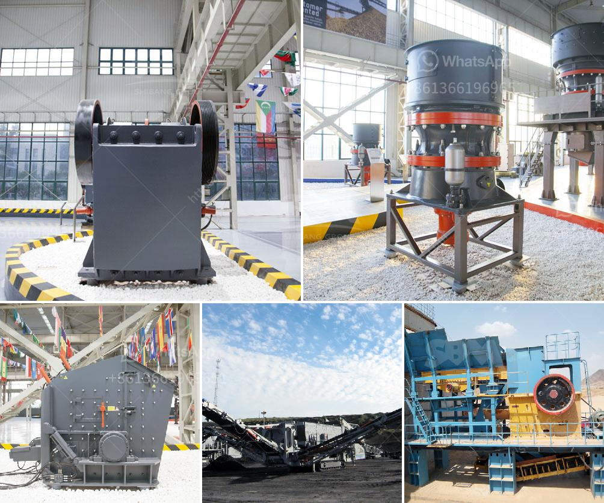

<h3>micro fine grinding mill</h3>
Micro fine grinding mill, also known as micro powder grinding mill, refers to a fine powder production machine widely used in various industries. It is mainly applied in metallurgy, chemical industry, power plant, cement plant, and other industries, and is the main equipment of grinding process. Micro fine grinding mill has been widely used in the field of fine grinding, ultrafine grinding, and ultrafine powder reversal, and plays an important role in the process of producing ultrafine powders.

As the main device for processing superfine powders, micro fine grinding mill has the following advantages:

1. High efficiency and energy-saving: Under the condition of the same fineness and motor power, the production capacity of micro fine grinding mill is twice that of jet mill, stirring mill, and ball mill. The energy consumption is only one-third of that of these mills, which greatly reduces the production cost.

2. Wide range of applications: Micro fine grinding mill can grind more than 300 kinds of materials with Mohs hardness below 9.3 and humidity below 6%, such as quartz, feldspar, bentonite, calcite, talc, barite, fluorite, marble, and limestone. It can be used for the ultrafine grinding of non-metallic minerals and metal ores.

3. Stable and reliable performance: The host of micro fine grinding mill adopts a sealed gearbox and a belt wheel design, which makes the transmission stable and reliable. The important parts of the mill are made of high-quality steel, which makes the machine more durable and prolongs the service life.

4. Safety and environmental protection: Micro fine grinding mill adopts a pulse dust collector to trap dust and reduce dust pollution during the grinding process. The equipment also has a unique silencer system to reduce noise pollution. Moreover, it has a high degree of automation and remote control, which reduces the risk of manual operation and ensures the safety of operators.

In addition to these advantages, micro fine grinding mill can also be equipped with auxiliary equipment such as crushers, hoists, storage bins, electromagnetic vibrating feeders, and electrical control cabinets, which can realize the integrated control of the entire production line, greatly improving the efficiency of material grinding and powder selection.

In conclusion, micro fine grinding mill is a high-efficiency and energy-saving grinding equipment that can process a wide range of materials. Its stable and reliable performance, safety and environmental protection features, as well as its wide range of applications make it the preferred choice for the production of superfine powders. With the continuous improvement of grinding technology, micro fine grinding mill will play a more important role in various industries and contribute to the development of the economy.
<h3>Contact us</h3><ul><li><strong>Whatsapp:&nbsp;<a href="https://wa.me/8613661969651">+8613661969651</a></strong></li><li><a href="https://swt.shibang-china.com/?git&amp;zhl&amp;micro fine grinding mill"><strong>Online Service(chat now)</strong></a></li></ul><h3>Related</h3><ul><li><a href='mobile jaw crusher for sale in pakistan.md'>mobile jaw crusher for sale in pakistan</a></li><li><a href='impact crusher saudi.md'>impact crusher saudi</a></li><li><a href='manufacturing process of kaolin crusher.md'>manufacturing process of kaolin crusher</a></li><li><a href='hard rock aggregates plant.md'>hard rock aggregates plant</a></li><li><a href='industrial application of pebble mill.md'>industrial application of pebble mill</a></li></ul>