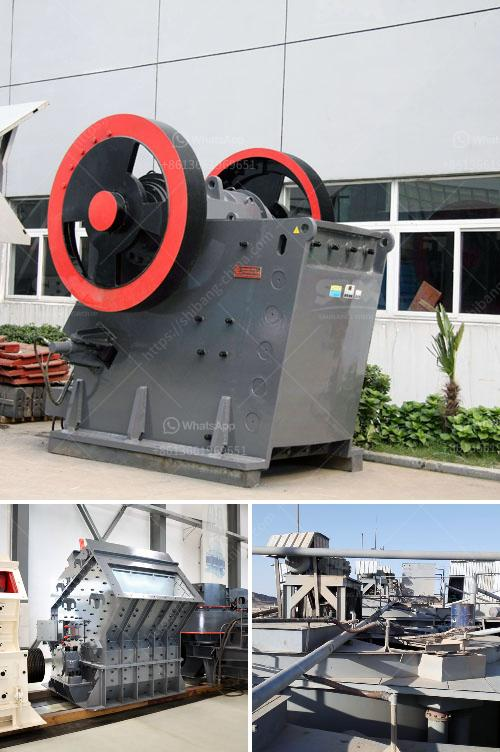

<h3>micronized quartz crusher plant</h3>
Micronized quartz is a material that is significantly used in various industries. Its fine particle size makes it ideal for different applications, such as glass manufacturing, ceramics production, and even construction. To extract the maximum benefits of micronized quartz, a crusher plant is required.

A micronized quartz crusher plant is widely used for crushing hard and brittle materials with a Mohs hardness of nine or less, such as quartz and other minerals in the construction industry. The crushing process involves breaking the ore into small particles, which are then sorted by size and further processed.

One of the key components of a micronized quartz crusher plant is the jaw crusher. This machine is responsible for primary crushing, reducing the raw materials to a size that can be further processed. It operates by exerting force on the material until it breaks apart.

The crushed quartz is then transferred to a cone crusher for secondary crushing. The cone crusher further reduces the size of the particles and produces a fine product. This is crucial for the micronization process, as it ensures that the material reaches the desired fineness.

After being crushed and processed, the micronized quartz is ready for various applications. In glass manufacturing, for example, micronized quartz is mixed with other materials and melted to produce glass products. Its high silica content allows for excellent transparency and durability.

In ceramics production, micronized quartz is used as a filler and a source of silicon. It enhances the strength and thermal stability of ceramics and ensures a smooth surface finish. Additionally, micronized quartz is also employed in the construction industry for manufacturing high-quality concrete and mortar.

In conclusion, a micronized quartz crusher plant plays a crucial role in extracting the maximum benefits from micronized quartz. By crushing and processing the raw materials, it ensures that the quartz reaches the desired fineness and can be used in various industries effectively. The crusher plant enables the production of high-quality glass, ceramics, and construction materials, contributing to the advancement of these sectors.
<h3>Contact us</h3><ul><li><strong>Whatsapp:&nbsp;<a href="https://wa.me/8613661969651">+8613661969651</a></strong></li><li><a href="https://swt.shibang-china.com/?git&amp;zhl&amp;micronized quartz crusher plant"><strong>Online Service(chat now)</strong></a></li></ul><h3>Related</h3><ul><li><a href='old jaw crusher for sale in kenya.md'>old jaw crusher for sale in kenya</a></li><li><a href='crusher screener forsale in sweden.md'>crusher screener forsale in sweden</a></li><li><a href='aggregate crusher plants machinery.md'>aggregate crusher plants machinery</a></li><li><a href='conveyor belt setup china.md'>conveyor belt setup china</a></li><li><a href='stone crusher plant list odisha.md'>stone crusher plant list odisha</a></li></ul>