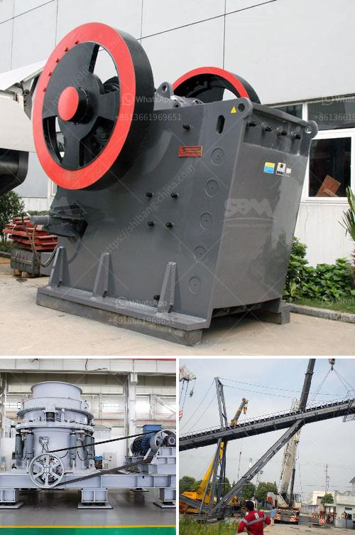

<h3>mill grinding machine in egypt</h3>
Mill grinding machines are widely used in industries such as mining, metallurgy, building materials, chemicals, and other materials processing sectors in Egypt. Nowadays, the demands for mills in the market are growing continuously. Different types of grinding mills have different production capacities, power, and fineness suitable for different applications.

One of the most common types of grinding mills in Egypt is the ball mill. This machine is typically used for grinding materials into powder by rotating a cylinder filled with steel or ceramic balls. The material is grinded by impact and friction between the balls and the grinding material inside the mill. Ball mills are widely used in cement, silicate products, new building materials, refractories, fertilizers, black and non-ferrous metal mineral processing, glass, ceramics, and other industries.

Another widely used grinding machine in Egypt is the Raymond mill. This mill is used for grinding various non-flammable and non-explosive minerals such as barite, calcite, potassium feldspar, talc, marble, limestone, dolomite, fluorite, lime, activated clay, activated carbon, bentonite, kaolin, cement, phosphate rock, gypsum, glass, insulation materials, etc. The fineness of the finished product can be adjusted from 30-425 mesh (0.613-0.044 mm) by adjusting the analyzer of the machine. The capacity of Raymond mill ranges from 0.8-20 tons per hour, depending on the model and size.

Apart from ball mills and Raymond mills, there are other grinding machines used in Egypt. For instance, the ultrafine mill is suitable for processing various non-flammable and explosive mineral materials with Mohs hardness below 9.3 and humidity below 6%. It can be used in the fine grinding of limestone, talc, barite, dolomite, calcite, marble, gypsum, bentonite, graphite, carbon black, coal, etc. The ultrafine mill has the advantages of high grinding efficiency, low energy consumption, and low noise. It is the preferred equipment for grinding fine powder.

In conclusion, mill grinding machines are essential equipment for various industries in Egypt. The ball mill, Raymond mill, and ultrafine mill are the most commonly used types of mills. These machines are suitable for grinding various materials, and their performance and fineness can be adjusted according to different requirements. With the continuous advancement of technology and the continuous improvement of grinding equipment, the development of the grinding industry in Egypt is also accelerating. It is believed that more efficient and advanced grinding machines will be developed in the future to meet the increasing demands of different industries.
<h3>Contact us</h3><ul><li><strong>Whatsapp:&nbsp;<a href="https://wa.me/8613661969651">+8613661969651</a></strong></li><li><a href="https://swt.shibang-china.com/?git&amp;zhl&amp;mill grinding machine in egypt"><strong>Online Service(chat now)</strong></a></li></ul><h3>Related</h3><ul><li><a href='coal pulverizer design.md'>coal pulverizer design</a></li><li><a href='clay beneficiation.md'>clay beneficiation</a></li><li><a href='stone crusher machines made in nigeria.md'>stone crusher machines made in nigeria</a></li><li><a href='grinding mill for bentonite.md'>grinding mill for bentonite</a></li><li><a href='cost a stone crusher.md'>cost a stone crusher</a></li></ul>