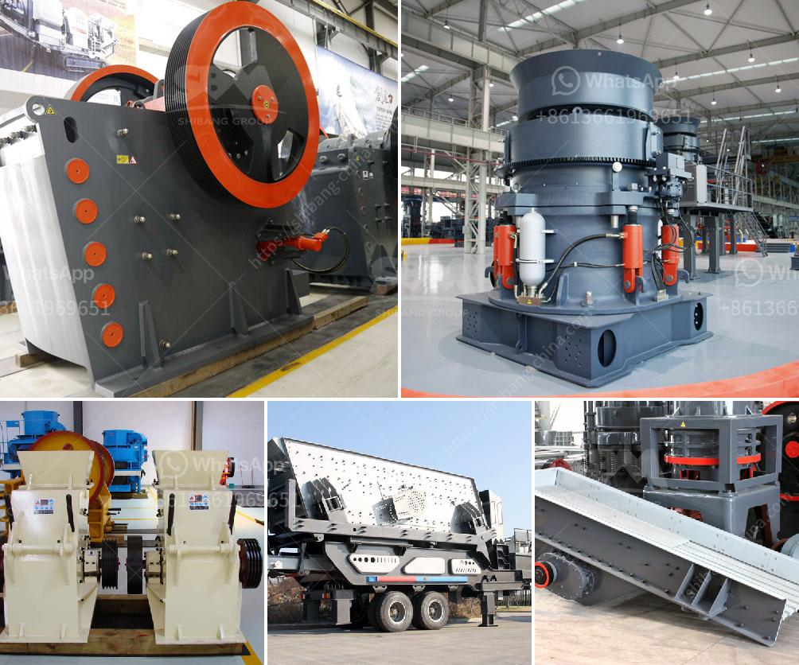

<h3>mill manufactures of hammer aryesanal</h3>
Hammer mills have been in use for centuries, and they continue to be an essential tool in various industries, from agriculture to construction. While large-scale manufacturing of hammer mills is commonplace today, let's delve into the world of artisanal mill manufacturers who pride themselves in handcrafting these versatile machines.

In recent years, there has been a resurgence in the appreciation for artisanal craftsmanship. Consumers are showing a growing interest in products that are made by hand, paying homage to traditional techniques and skills. The same can be said for the mill manufacturing industry, where small-scale artisanal millmakers have carved out a niche for themselves.

One such artisanal millmaker is John Smith, who runs a small workshop in a quiet countryside village. Smith, a true craftsman at heart, has dedicated his life to perfecting the art of manufacturing hammer mills. When you visit his workshop, you are transported back in time as you witness his meticulous and skillful crafting process.

Smith sources only the highest quality materials for his hammer mills. He personally selects each piece of wood, ensuring it possesses the right strength and durability required for the job. Other materials, such as steel, are carefully chosen and measured to guarantee optimal performance. Smith believes that using the best materials is a crucial step in ensuring the longevity of his creations.

The manufacturing process of an artisanal hammer mill is a labor-intensive one. Smith meticulously hand-carves the wooden components, paying close attention to every detail. From the curved shape of the mill's body to the precision drilling of holes, his expertise shines through in every step.

Once the wooden components are complete, Smith moves on to assembling the mill. With patience and precision, he aligns each component, ensuring a perfect fit. The steel components, such as the hammerhead and grinding plates, are hand-forged and customized to suit the specific needs of individual clients. This level of customization sets artisanal hammer mills apart from their mass-produced counterparts.

One of the most remarkable aspects of artisanal mill manufacturing is the attention given to quality control. Smith performs rigorous testing on each mill throughout the manufacturing process. He checks for smooth operation, proper weight distribution, and adjustability to meet various grinding needs. This committed quality control ensures that each hammer mill leaving his workshop performs optimally.

Not only do artisanal mill manufacturers value quality and craftsmanship, but they also prioritize sustainability. High-quality materials, combined with the durability of handcrafted construction, significantly extend the lifespan of these mills. By avoiding mass production and embracing traditional methods, these artisans minimize waste and carbon footprint, making their products more environmentally friendly.

While machine-made hammer mills effectively serve their purpose, the artisanal approach has its unique charm and appeal. By maintaining the tradition of handcrafting mills, artisans like John Smith keep age-old techniques alive. Their passion for the craft manifests in each hammer mill they create, providing a valuable alternative for those who appreciate the artistry and precision of handmade tools.

As we celebrate the ingenuity of artisanal mill manufacturers, we are reminded of the extraordinary craftsmanship that is at the heart of their creations. These remarkable individuals contribute not only to their craft but also to the preservation of our cultural heritage. So, the next time you come across a handcrafted hammer mill, take a moment to appreciate the skill, dedication, and timeless beauty that went into its creation.
<h3>Contact us</h3><ul><li><strong>Whatsapp:&nbsp;<a href="https://wa.me/8613661969651">+8613661969651</a></strong></li><li><a href="https://swt.shibang-china.com/?git&amp;zhl&amp;mill manufactures of hammer aryesanal"><strong>Online Service(chat now)</strong></a></li></ul><h3>Related</h3><ul><li><a href='use of the ball mill.md'>use of the ball mill</a></li><li><a href='gypsum processing plant.md'>gypsum processing plant</a></li><li><a href='belt conveyor for stone aggregate.md'>belt conveyor for stone aggregate</a></li><li><a href='india jaw crusher of small capacity.md'>india jaw crusher of small capacity</a></li><li><a href='stone crusher equipment.md'>stone crusher equipment</a></li></ul>