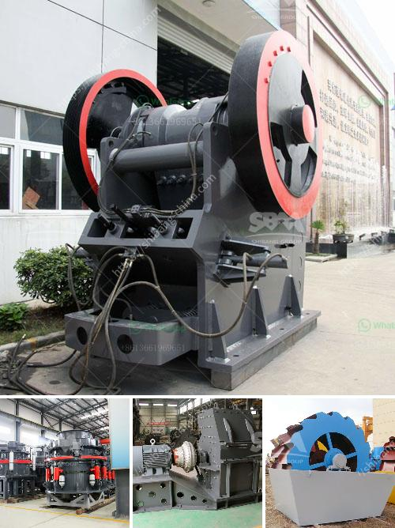

<h3>mineral crusher processing plants china</h3>
The mineral processing industry in China encompasses a wide range of activities, from the exploration, extraction, and processing of minerals to the shaping and manufacturing of mineral-based products. With a vast reserve of natural resources, China has gained a significant presence globally in this sector. One vital component of mineral processing plants is the mineral crusher, a device that plays a crucial role in the crushing of various types of minerals into smaller pieces for further processing.

China is known for its strong mining industry, which has significantly contributed to the nation's economic growth. Mineral crushers are integral to this industry, as they enable the extraction of valuable minerals from the Earth's crust for use in various applications such as construction, manufacturing, and energy production. They are designed to break down rocks and ores into smaller particles, allowing for the separation and subsequent refinement of the desired mineral.

Chinese mineral processing plants have made remarkable strides in terms of technological development and innovation. These plants are equipped with sophisticated crushers that utilize advanced techniques to optimize the efficiency and output of mineral processing. Jaw crushers, impact crushers, cone crushers, and hammer crushers are commonly used in Chinese mineral processing plants, each with its unique characteristics and applications.

The demand for minerals in China has been continuously growing due to rapid industrialization and urbanization. As a result, the mineral processing industry has experienced a surge in production, making mineral crushers an indispensable component of the manufacturing process. Furthermore, the utilization of advanced crushers has not only improved productivity but also reduced environmental impact, helping these plants adhere to sustainable practices.

The Chinese government has recognized the importance of sustainable mineral processing practices and has implemented policies to regulate the industry's operations. These regulations not only emphasize safety and environmental stewardship but also encourage the development and utilization of advanced technologies in mineral processing plants.

In conclusion, mineral crusher processing plants in China are experiencing substantial growth, primarily driven by the nation's strong mining industry. With advanced technology and a focus on sustainability, these plants play a vital role in supplying the raw materials needed for various sectors. As China continues to develop and expand its industrial capabilities, the demand for mineral crushers and processing plants will likely increase, further propelling this multifaceted industry forward.
<h3>Contact us</h3><ul><li><strong>Whatsapp:&nbsp;<a href="https://wa.me/8613661969651">+8613661969651</a></strong></li><li><a href="https://swt.shibang-china.com/?git&amp;zhl&amp;mineral crusher processing plants china"><strong>Online Service(chat now)</strong></a></li></ul><h3>Related</h3><ul><li><a href='hammer mill for sale ebay.md'>hammer mill for sale ebay</a></li><li><a href='ballast crushing machine in kenya.md'>ballast crushing machine in kenya</a></li><li><a href='production of stone crusher.md'>production of stone crusher</a></li><li><a href='ball mill liners manufacturers.md'>ball mill liners manufacturers</a></li><li><a href='stone crusher in davao.md'>stone crusher in davao</a></li></ul>