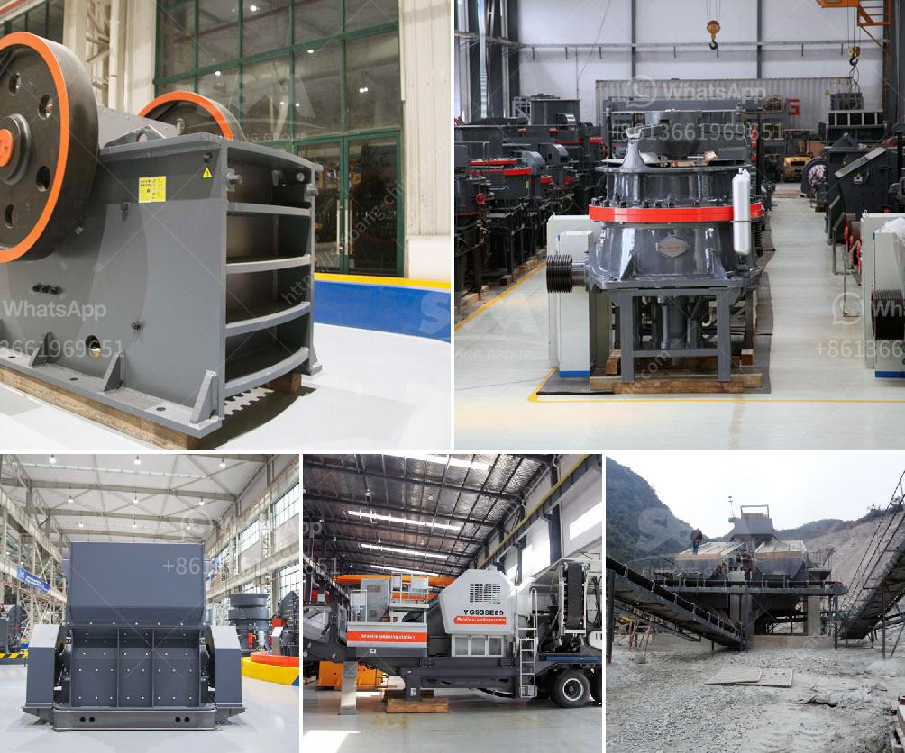

<h3>mineral mining and processing plant in south africa</h3>
South Africa is one of the world leaders in mining and minerals processing, with an estimated $35 billion worth of mineral reserves. The country’s mineral deposits are mainly extracted through open-pit mining, which is widespread in South Africa due to its rich underground resources. Nearly all the country’s minerals are exported, making mining a crucial economic activity for South Africa.

Mining in South Africa has been a significant industry for over a century, and it has a long history of producing a wide variety of minerals. Some of the most popular minerals found in South Africa include gold, platinum, diamonds, coal, and copper. The country is also a top global supplier of minerals like manganese, chrome, and vanadium.

The mining industry in South Africa employs over 450,000 workers, providing opportunities to the local communities and contributing significantly to the country’s economy. The mineral processing sector in South Africa is diverse and encompasses a wide variety of processes involving the transformation of the raw minerals into refined products.

To process minerals, companies typically use methods such as crushing, milling, and grinding to reduce the size of the minerals. These processes help extract the valuable minerals from the ore, separating them from the waste material. Once the minerals are extracted, they undergo further processing to purify and refine them into the desired end-products.

South Africa is home to several mineral processing plants that utilize advanced technology and equipment to treat the abundant mineral resources. These processing plants are crucial to the efficient recovery and utilization of minerals, ensuring their transformation into valuable materials that can be used in various industries.

In conclusion, mineral mining and processing plants play a significant role in South Africa's economy. The country’s rich mineral resources, coupled with its well-established mining industry, make it a key player in the global mining and processing sector. The sector not only creates employment opportunities but also provides essential raw materials for various industries locally and globally. As the mining industry continues to evolve and adapt to new technologies and environmentally friendly practices, it is poised to contribute to South Africa's ongoing economic development and sustainable growth.
<h3>Contact us</h3><ul><li><strong>Whatsapp:&nbsp;<a href="https://wa.me/8613661969651">+8613661969651</a></strong></li><li><a href="https://swt.shibang-china.com/?git&amp;zhl&amp;mineral mining and processing plant in south africa"><strong>Online Service(chat now)</strong></a></li></ul><h3>Related</h3><ul><li><a href='contnious ball mill drawing.md'>contnious ball mill drawing</a></li><li><a href='crushing complete crushing plant 150tph 200tph.md'>crushing complete crushing plant 150tph 200tph</a></li><li><a href='what is expected cost of 100 tph crushing plant.md'>what is expected cost of 100 tph crushing plant</a></li><li><a href='sand core machine manufacturers.md'>sand core machine manufacturers</a></li><li><a href='stone crusher usa.md'>stone crusher usa</a></li></ul>