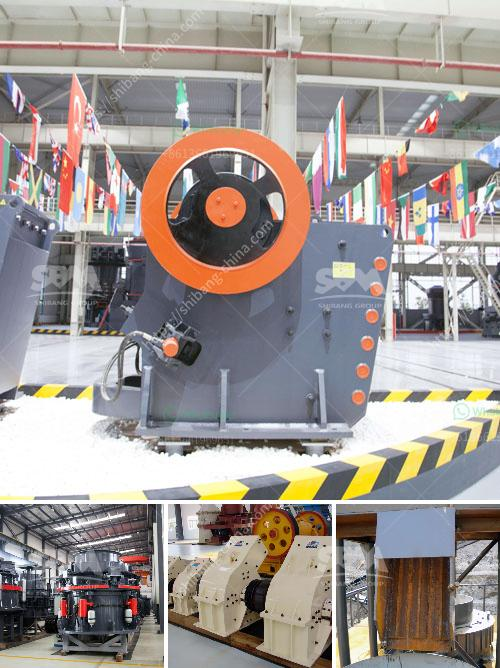

<h3>mini cement plant capacity of 5 ton per day</h3>
Mini cement plant refers to a small-scale cement manufacturing project with a daily capacity of 5 tons. The cement plant is designed to produce high-quality cement, mainly used for small-scale construction projects.

The demand for cement in the construction industry is constantly growing, creating opportunities for small-scale cement plants to flourish. A mini cement plant with a capacity of 5 tons per day meets the requirements of local construction projects and ensures a steady supply of cement.

One of the key advantages of a mini cement plant is its cost-effectiveness. Compared to large-scale cement plants, these mini plants require lower investment and have lower operational costs. They also have a smaller footprint, making them suitable for areas with limited space.

The production process in a mini cement plant is similar to that of regular cement plants but on a smaller scale. The raw materials required for cement production, such as limestone, clay, and gypsum, are crushed and then ground into a fine powder. This powder is then heated in a kiln at high temperatures to produce clinker, which is the main ingredient in cement. The clinker is further processed to produce cement by adding gypsum and other additives.

A mini cement plant with a daily capacity of 5 tons can produce around 150 tons of cement per month. This is sufficient to meet the demands of small-scale construction projects, including residential buildings, schools, hospitals, and small commercial structures. The cement produced by these mini plants is of high quality and meets industry standards.

Operating a mini cement plant requires skilled manpower and appropriate machinery. The plant typically includes crushers, mills, rotary kilns, and other equipment necessary for the cement production process. Additionally, electricity supply, water sources, and transportation infrastructure need to be in place to ensure smooth operations.

Furthermore, mini cement plants can be environmentally friendly. Unlike large-scale cement plants, mini plants have lower emissions and consume less energy. They can also recycle waste materials, making them more sustainable.

Setting up a mini cement plant requires careful planning and feasibility studies. Factors such as market demand, availability of raw materials, and access to transportation should be considered. Additionally, obtaining necessary permits and complying with environmental regulations is crucial.

In conclusion, a mini cement plant with a daily capacity of 5 tons is a viable investment for small-scale entrepreneurs in the construction industry. It provides opportunities for local employment, contributes to infrastructure development, and meets the growing demand for cement in the market. With proper planning and execution, mini cement plants can be profitable and environmentally friendly ventures.
<h3>Contact us</h3><ul><li><strong>Whatsapp:&nbsp;<a href="https://wa.me/8613661969651">+8613661969651</a></strong></li><li><a href="https://swt.shibang-china.com/?git&amp;zhl&amp;mini cement plant capacity of 5 ton per day"><strong>Online Service(chat now)</strong></a></li></ul><h3>Related</h3><ul><li><a href='crusher machines supplier in philippines.md'>crusher machines supplier in philippines</a></li><li><a href='coal conveyor manufacturer germany.md'>coal conveyor manufacturer germany</a></li><li><a href='super fine powder mill.md'>super fine powder mill</a></li><li><a href='ball mill for aluminum powder.md'>ball mill for aluminum powder</a></li><li><a href='mobile crusher on rent for iron ore.md'>mobile crusher on rent for iron ore</a></li></ul>