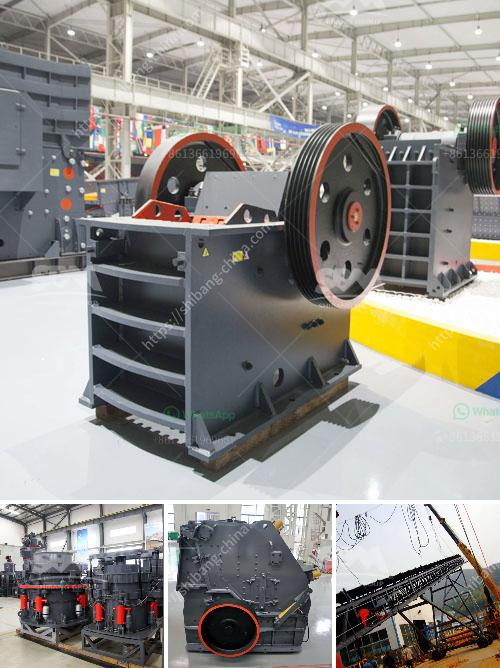

<h3>mini cement plant grinding project report</h3>
A mini cement plant grinding project is a key step in the cement production process. This project aims to develop a new type of cement grinding unit with the capacity of 100-150 tons per hour. This involves the construction of a new grinding unit near the existing cement plant in Dhaka, Bangladesh. The project will enable the company to meet the growing demand for cement in the country.

The report begins with an overview of the cement industry in Bangladesh and the need for a new grinding unit. It discusses the project objectives, which include increasing the company's production capacity and improving its operational efficiency. The report then outlines the project scope, which includes the construction of a new grinding unit, installation of necessary machinery and equipment, and the development of a new cement storage and distribution system.

The project timeline is also provided, highlighting the various tasks and milestones that need to be completed. The estimated cost of the project is mentioned, along with the projected revenue and profitability. The report also discusses the potential challenges and risk factors that the project may face, such as regulatory approvals, environmental concerns, and labor issues.

The next section of the report focuses on the technical aspects of the project. It describes in detail the process of cement grinding and the various equipment and machinery that will be used in the new grinding unit. The report also discusses the raw materials requirements and the process of sourcing and procurement.

The project report then provides a detailed financial analysis, including the projected income statement, balance sheet, and cash flow statement. It also highlights the project's financial viability and return on investment. The report includes a sensitivity analysis, which examines the impact of changes in key assumptions on the project's financial performance.

The report concludes with a summary of the project's key findings and recommendations. It highlights the potential benefits of the project, including increased production capacity, improved operational efficiency, and enhanced market competitiveness. The report also suggests areas for further research and development, such as the use of alternative fuels and materials in cement production.

In conclusion, the mini cement plant grinding project report outlines the key aspects of a new cement grinding unit, from its objectives and scope to the technical and financial details. It highlights the potential benefits and challenges of the project, while also providing recommendations for future improvements. Overall, this project is expected to contribute to the growth and development of the cement industry in Bangladesh.
<h3>Contact us</h3><ul><li><strong>Whatsapp:&nbsp;<a href="https://wa.me/8613661969651">+8613661969651</a></strong></li><li><a href="https://swt.shibang-china.com/?git&amp;zhl&amp;mini cement plant grinding project report"><strong>Online Service(chat now)</strong></a></li></ul><h3>Related</h3><ul><li><a href='project report for starting a crusher plant in tamilnadu.md'>project report for starting a crusher plant in tamilnadu</a></li><li><a href='mobile vibrating screen.md'>mobile vibrating screen</a></li><li><a href='cost of concrete batch plant.md'>cost of concrete batch plant</a></li><li><a href='vsi crusher for quartz.md'>vsi crusher for quartz</a></li><li><a href='bentonite processing machinery.md'>bentonite processing machinery</a></li></ul>