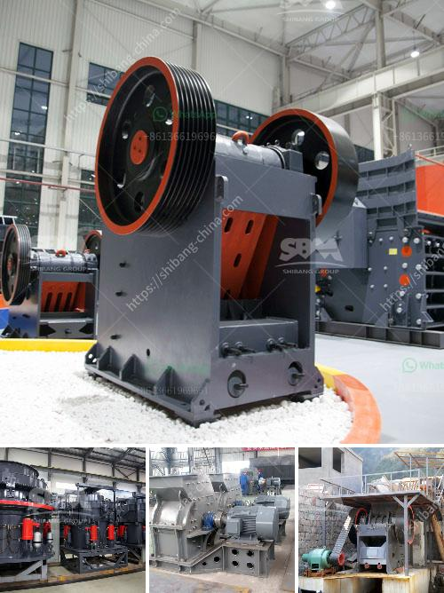

<h3>mini cement plant project cost</h3>
A mini cement plant project cost is determined by various factors like the quality and type of cement plant. Some of these factors include the cost of land, construction costs, machinery and equipment, raw materials, and labor costs.

A mini cement plant can have a production capacity of either 50 tons per day or 200 tons per day. Typically, a mini cement plant costs between $50 and $100 per ton of cement produced. The total project cost depends on the chosen capacity and the location of the plant. For instance, setting up a mini cement plant in a rural area will be cheaper compared to setting it up in an urban area due to lower land costs.

The cost of land is an important factor in determining the overall project cost. The land requirement for a mini cement plant is usually around 1 acre. The cost of purchasing the land can vary depending on location and availability.

The construction costs include the cost of building structures, infrastructure, and utilities like power supply and water. Skilled labor and techniques may also be required, adding to the construction costs.

Machinery and equipment costs include crushers, kilns, cement mills, and packaging machines. The choice of machinery depends upon the capacity of the project. Quality machinery ensures a higher level of efficiency and reduces maintenance costs in the long run.

Raw materials like limestone, clay, and gypsum are required for cement production. The availability and cost of these raw materials can vary based on the region. It is essential to have a steady supply of raw materials to ensure uninterrupted production.

Labor costs include salaries and wages for the workforce. The number of skilled and unskilled workers required will depend on the plant's capacity.

In conclusion, the cost of a mini cement plant project varies depending on various factors such as capacity, location, raw material availability, and labor costs. Thorough research and planning are necessary to estimate the project cost accurately. Consulting experts and conducting a feasibility study can help in ensuring the project's success and profitability.
<h3>Contact us</h3><ul><li><strong>Whatsapp:&nbsp;<a href="https://wa.me/8613661969651">+8613661969651</a></strong></li><li><a href="https://swt.shibang-china.com/?git&amp;zhl&amp;mini cement plant project cost"><strong>Online Service(chat now)</strong></a></li></ul><h3>Related</h3><ul><li><a href='project cost of clinker grinding unit.md'>project cost of clinker grinding unit</a></li><li><a href='mobile crusher on rent for iron ore.md'>mobile crusher on rent for iron ore</a></li><li><a href='bentonite processing machinery.md'>bentonite processing machinery</a></li><li><a href='used basalt stone crusher price in uae.md'>used basalt stone crusher price in uae</a></li><li><a href='business plan for a calcium carbonate.md'>business plan for a calcium carbonate</a></li></ul>