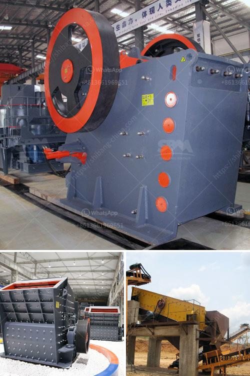

<h3>mini concrete crusher hire high wycombe</h3>
If you are searching for a reliable and professional company to tackle your concrete crusher hire needs, then you have come to the right place. We have been providing high-quality services in the High Wycombe area for many years and have a wealth of experience in the industry.

There are several reasons why you might need to hire a mini concrete crusher. Perhaps you are planning a home renovation and need to dispose of old concrete, or maybe you need to clear a site before starting construction work. Hiring a mini concrete crusher can save you time and effort, as well as help you avoid the cost of buying new concrete for your project.

Our mini concrete crushers are compact and efficient machines that can fit into tight spaces, making them ideal for small-scale construction projects. They can easily crush concrete into reusable materials, such as gravel or crushed stone, which can then be used as a base for new construction or landscaping.

When you choose our mini concrete crusher hire services in High Wycombe, you can expect a range of benefits. Firstly, we provide prompt and reliable service, ensuring that your project can proceed without delays. Our team of skilled operators will deliver the crusher to your site at a prearranged time, and they will set it up and show you how to use it safely.

Secondly, our mini concrete crushers are designed to be user-friendly. They are equipped with simple controls and are straightforward to operate, even for those with limited experience. If you have any questions or need assistance during the hire period, our knowledgeable staff will be on hand to help.

Another advantage of hiring our mini concrete crusher is that it is an environmentally friendly option. By recycling your old concrete, you can reduce waste and minimize the amount of material sent to landfill. This is not only good for the environment but can also help you meet sustainability goals and regulations set by local authorities.

We understand that every project is unique, and budget constraints can vary. That is why we offer flexible hire options to suit your needs and budget. Whether you require a mini concrete crusher for a few days or several weeks, we can tailor a hire package that is most suitable for you. Our rates are competitive and include delivery, setup, and collection, so you do not have to worry about any hidden costs.

In summary, if you are in need of a mini concrete crusher in High Wycombe or the surrounding areas, our company is the one to trust. We have years of experience in the industry and offer prompt, affordable, and environmentally friendly service. Contact us today to discuss your requirements and to arrange your mini concrete crusher hire.
<h3>Contact us</h3><ul><li><strong>Whatsapp:&nbsp;<a href="https://wa.me/8613661969651">+8613661969651</a></strong></li><li><a href="https://swt.shibang-china.com/?git&amp;zhl&amp;mini concrete crusher hire high wycombe"><strong>Online Service(chat now)</strong></a></li></ul><h3>Related</h3><ul><li><a href='aggregate production.md'>aggregate production</a></li><li><a href='marble powder mill machinery.md'>marble powder mill machinery</a></li><li><a href='dolomite grinding mill for sale in india.md'>dolomite grinding mill for sale in india</a></li><li><a href='economic analysis of conveyor system.md'>economic analysis of conveyor system</a></li><li><a href='fly ash grinding mill.md'>fly ash grinding mill</a></li></ul>