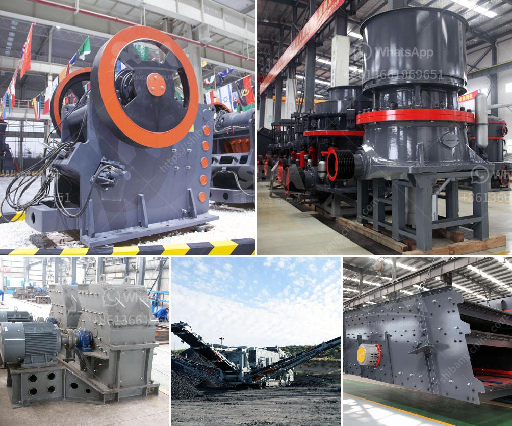

<h3>mini concrete crusher</h3>
Demolition of buildings and structures are inevitable as cities and towns evolve. However, the process of tearing down a structure is not as simple as it may seem. It requires careful planning and execution to ensure safety and efficiency. One crucial aspect of any demolition project is the disposal of the debris, which often consists of concrete. To address this issue, a mini concrete crusher has emerged as a cost-effective solution for small-scale demolition projects.

A mini concrete crusher is a small piece of equipment that is specifically designed to crush large fragments of concrete into smaller pieces. These compact machines are becoming more popular due to their versatility and ability to process different types of materials efficiently. With a mini concrete crusher, contractors can easily break down concrete into reusable aggregates that can be used as a base material for new construction projects.

One of the main advantages of utilizing a mini concrete crusher is its portability. These crushers are compact and lightweight, allowing contractors to transport them easily to the job site. This feature is particularly beneficial for small-scale demolition projects, where mobility is key. The crusher can be quickly set up and put into operation, saving valuable time and effort.

Another advantage of using a mini concrete crusher is its ability to process concrete on-site. Traditionally, concrete debris would be hauled to a landfill, incurring significant transportation costs. However, with a mini concrete crusher, contractors can crush the concrete on-site, eliminating the need for transportation and reducing the carbon footprint associated with debris disposal.

Furthermore, a mini concrete crusher is highly efficient in breaking down concrete into reusable aggregates. These crushers feature powerful jaws or hammers that exert immense force on the concrete, breaking it down into smaller pieces. The resulting crushed concrete can be used as a base material for new construction projects, reducing the need for virgin aggregates and promoting sustainability.

Moreover, mini concrete crushers are cost-effective. They offer an affordable alternative to traditional crushing equipment, which may be too large or expensive for small-scale projects. With a mini concrete crusher, contractors can save on equipment rental or machinery purchase costs, maximizing their project budget.

In conclusion, a mini concrete crusher is a versatile and efficient solution for small-scale demolition projects. Its portability, on-site processing capability, and cost-effectiveness make it a valuable asset for contractors. By utilizing a mini concrete crusher, contractors can reduce transportation costs, minimize the carbon footprint, and obtain reusable aggregates for future construction projects. As cities continue to develop and evolve, the mini concrete crusher proves to be a valuable tool in the demolition industry.
<h3>Contact us</h3><ul><li><strong>Whatsapp:&nbsp;<a href="https://wa.me/8613661969651">+8613661969651</a></strong></li><li><a href="https://swt.shibang-china.com/?git&amp;zhl&amp;mini concrete crusher"><strong>Online Service(chat now)</strong></a></li></ul><h3>Related</h3><ul><li><a href='crusher machine kenya.md'>crusher machine kenya</a></li><li><a href='second hand ball mill europe.md'>second hand ball mill europe</a></li><li><a href='chrome mining equipment and machinery.md'>chrome mining equipment and machinery</a></li><li><a href='vibrating feeder screen.md'>vibrating feeder screen</a></li><li><a href='granite stone quarrying equipment.md'>granite stone quarrying equipment</a></li></ul>