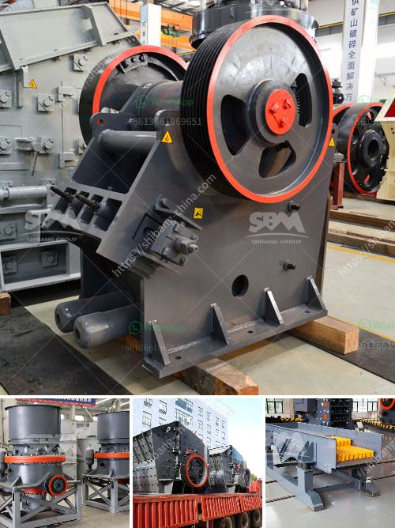

<h3>mini crusher roller mill</h3>
The mini crusher roller mill is a compact and easy-to-use machine that helps in the crushing and grinding of a variety of materials. This versatile equipment can be used in different industries such as mining, agriculture, and construction. With its small size and powerful capabilities, it is an essential tool for many businesses.

One of the main advantages of the mini crusher roller mill is its efficiency in reducing material to a finer size. It can crush and grind materials such as rocks, ores, and industrial minerals, making it suitable for various applications. This machine can handle both wet and dry materials, making it suitable for use in different environments.

Another benefit of the mini crusher roller mill is its ease of use. It is designed to be user-friendly, with simple controls and a compact size. This makes it easy for operators with little experience to operate the machine efficiently. It also takes up less space compared to traditional crushers and mills, making it ideal for businesses with limited space.

In terms of cost-effectiveness, the mini crusher roller mill is a great investment. It provides high productivity at a lower cost compared to larger crushing and grinding equipment. This makes it suitable for small to medium-sized businesses that want to optimize their operations without breaking the bank.

Additionally, the mini crusher roller mill is designed for durability and long-term use. It is built with high-quality materials and components that can withstand harsh working conditions. This ensures that the machine will continue to perform efficiently even in demanding applications.

In conclusion, the mini crusher roller mill is a versatile and efficient machine for crushing and grinding various materials. Its small size, ease of use, and cost-effectiveness make it a valuable tool for businesses in different industries. Whether it is used in mining, agriculture, or construction, this machine is sure to improve productivity and optimize operations.
<h3>Contact us</h3><ul><li><strong>Whatsapp:&nbsp;<a href="https://wa.me/8613661969651">+8613661969651</a></strong></li><li><a href="https://swt.shibang-china.com/?git&amp;zhl&amp;mini crusher roller mill"><strong>Online Service(chat now)</strong></a></li></ul><h3>Related</h3><ul><li><a href='trackmounted mobile crusher.md'>track-mounted mobile crusher</a></li><li><a href='cost of the process of mining limestone.md'>cost of the process of mining limestone</a></li><li><a href='iron ore pellet making process.md'>iron ore pellet making process</a></li><li><a href='contnious ball mill drawing.md'>contnious ball mill drawing</a></li><li><a href='jaw rock crusher price by owner.md'>jaw rock crusher price by owner</a></li></ul>