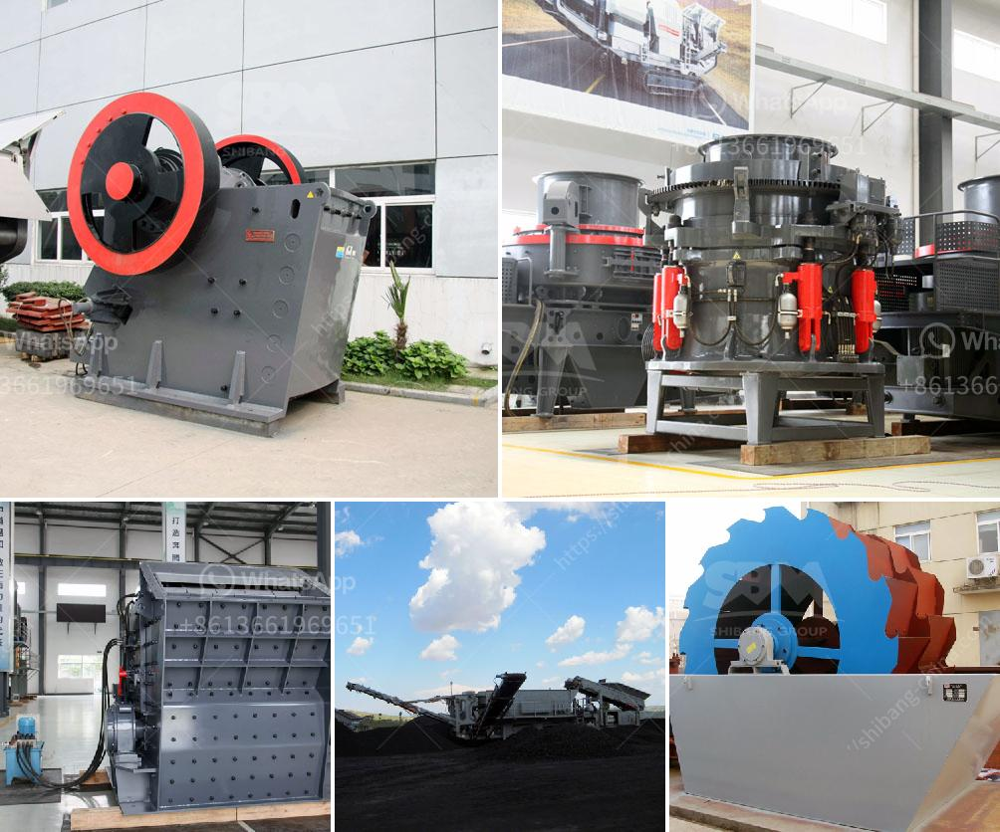

<h3>mini crushers for sale</h3>
In the ever-evolving world of construction and demolition, contractors are constantly seeking ways to improve efficiency and productivity. One solution that has been gaining popularity in recent years is the use of mini crushers. These compact, powerful machines offer significant advantages over traditional crushers, making them a valuable addition to any job site.

Mini crushers are smaller, more mobile versions of regular crushers. They are designed to fit into tight spaces without sacrificing performance or power. Despite their compact size, these crushers are capable of processing a wide range of materials, from concrete and asphalt to demolition debris and natural stone.

One of the notable advantages of mini crushers is their ability to be transported easily. They can be moved from site to site quickly, increasing flexibility for contractors. This mobility is especially useful for projects in urban areas or on crowded job sites where space is limited. Additionally, the lightweight nature of mini crushers allows for easy maneuverability, making them ideal for use in tight and narrow spaces.

Although mini crushers are smaller in size, they are not lacking in power. These machines feature strong, efficient engines that can deliver a high crushing force. Their compact design allows for greater force concentration, resulting in effective and quick crushing. This efficiency translates into cost savings and increased productivity for contractors.

The versatility of mini crushers is another key advantage. With various attachments and options available, these machines can be customized to meet the specific needs of different job sites. Whether it's a small demolition project, excavation work, or recycling materials, mini crushers can be equipped with the necessary tools to get the job done efficiently.

Furthermore, mini crushers are designed to be user-friendly and require minimal maintenance. This reduces downtime and increases the overall productivity of the machine. Additionally, many manufacturers offer excellent after-sales support and spare parts availability, ensuring that the crushers remain operational for long periods.

The growing demand for environmentally-friendly practices in the construction industry has also fueled the popularity of mini crushers. These machines are often equipped with advanced dust suppression systems, reducing fugitive dust emissions and improving air quality on job sites. Furthermore, mini crushers can contribute to sustainable practices by recycling materials directly on site, eliminating the need to transport and dispose of waste elsewhere.

While mini crushers offer numerous advantages, they are not without their limitations. Their small size means they have a lower processing capacity compared to larger crushers. Therefore, they may not be suitable for large-scale projects or heavy-duty applications. It is important for contractors to evaluate their specific requirements before investing in mini crushers.

In conclusion, mini crushers have emerged as a valuable tool for contractors looking to improve efficiency and productivity on job sites. With their compact size, powerful engines, and versatile capabilities, these machines offer a range of advantages over traditional crushers. Whether it's their mobility, ease of use, or environmental benefits, mini crushers have firmly established themselves as a valuable addition to the construction and demolition industry.
<h3>Contact us</h3><ul><li><strong>Whatsapp:&nbsp;<a href="https://wa.me/8613661969651">+8613661969651</a></strong></li><li><a href="https://swt.shibang-china.com/?git&amp;zhl&amp;mini crushers for sale"><strong>Online Service(chat now)</strong></a></li></ul><h3>Related</h3><ul><li><a href='coal pulveriser manufacturer.md'>coal pulveriser manufacturer</a></li><li><a href='stone crusher price of 30 tons per hour.md'>stone crusher price of 30 tons per hour</a></li><li><a href='hammer mill for coal in india.md'>hammer mill for coal in india</a></li><li><a href='used crusher machine germany.md'>used crusher machine germany</a></li><li><a href='used mining equipment uk.md'>used mining equipment uk</a></li></ul>