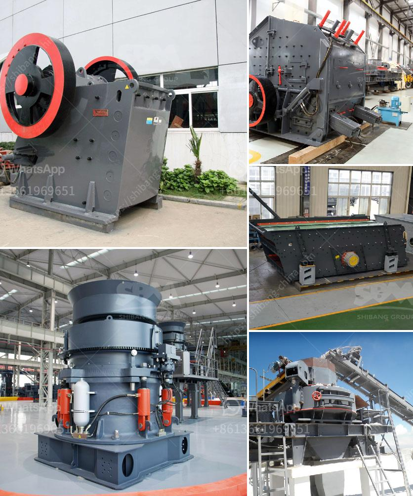

<h3>mining equipment for sale zimbabwe</h3>
Mining Equipment for Sale Zimbabwe - The distinctive process of acquiring a mining concession in Zimbabwe has made the nation an investor’s paradise. Where else will you find a mining destination with over 60 mineral occurrences and lucrative opportunities to explore and discover abundant reserves? In Zimbabwe, the vast potential for mining has attracted investors from all corners of the world, driven by the desire to profit from the country's vast mineral wealth.

To fully exploit the potential that Zimbabwe's mining sector offers, you need the right equipment. Buying top-quality mining equipment ensures a smooth and efficient mining operation, enhancing productivity and maximizing profits. As a country rich in gold, diamonds, platinum, and coal, Zimbabwe provides a variety of mining equipment available for sale to mine these precious resources.

One of the key players providing mining equipment for sale in Zimbabwe is Mining Equipment. It prides itself in offering high-quality mining solutions that guarantee maximum productivity, and safe operations. They have a wide range of mining equipment suitable for both surface and underground mining operations.

For surface mining, Mining Equipment offers robust and reliable equipment such as bulldozers, wheel loaders, dump trucks, and hydraulic excavators. These machines are designed to handle tough terrains and perform various tasks such as earthmoving, hauling, and loading. Bulldozers are indispensable for surface mining activities as they level the ground, clear obstacles, and create access roads on mining sites. Wheel loaders are used to load extracted materials into trucks for transportation, while dump trucks move materials from one area of the mine to another. Hydraulic excavators are used for digging and extracting minerals from the earth's surface efficiently.

For underground mining, Mining Equipment offers a range of equipment such as drill rigs, loaders, and haulage trucks. Drill rigs are essential for exploration and drilling of minerals underground. They are designed to bore deep into the earth, ensuring accurate and efficient extraction. Loaders are used for transporting minerals and debris within underground mines, improving efficiency and safety. Haulage trucks are used to move materials from the mining face to the surface, enabling continuous operations.

Mining Equipment also provides a range of support equipment necessary for mining operations, including compressors, generators, and pumps. Compressors supply compressed air for various mining tasks, such as powering tools and machinery underground. Generators provide a reliable source of power, ensuring uninterrupted operations. Pumps are used for dewatering mines and facilitating the flow of water for other mining activities.

In addition to providing mining equipment for sale, Mining Equipment offers comprehensive aftersales support, including servicing, repairs, and spare parts. This ensures that mining operations can continue smoothly, with minimal downtime due to equipment malfunctions.

Investing in high-quality mining equipment is crucial for successful mining operations in Zimbabwe. Therefore, companies like Mining Equipment play an integral role in the nation's mining industry by providing top-of-the-line equipment and ongoing support services. With the right equipment in place, investors can embark on efficient and productive mining ventures, unlocking Zimbabwe's vast mineral potential and reaping substantial profits.
<h3>Contact us</h3><ul><li><strong>Whatsapp:&nbsp;<a href="https://wa.me/8613661969651">+8613661969651</a></strong></li><li><a href="https://swt.shibang-china.com/?git&amp;zhl&amp;mining equipment for sale zimbabwe"><strong>Online Service(chat now)</strong></a></li></ul><h3>Related</h3><ul><li><a href='conveyor belt design manual pdf.md'>conveyor belt design manual pdf</a></li><li><a href='quartz stone dust equipment.md'>quartz stone dust equipment</a></li><li><a href='grinder machine for quartz.md'>grinder machine for quartz</a></li><li><a href='mobile crusher rates per hour.md'>mobile crusher rates per hour</a></li><li><a href='roller mill working.md'>roller mill working</a></li></ul>