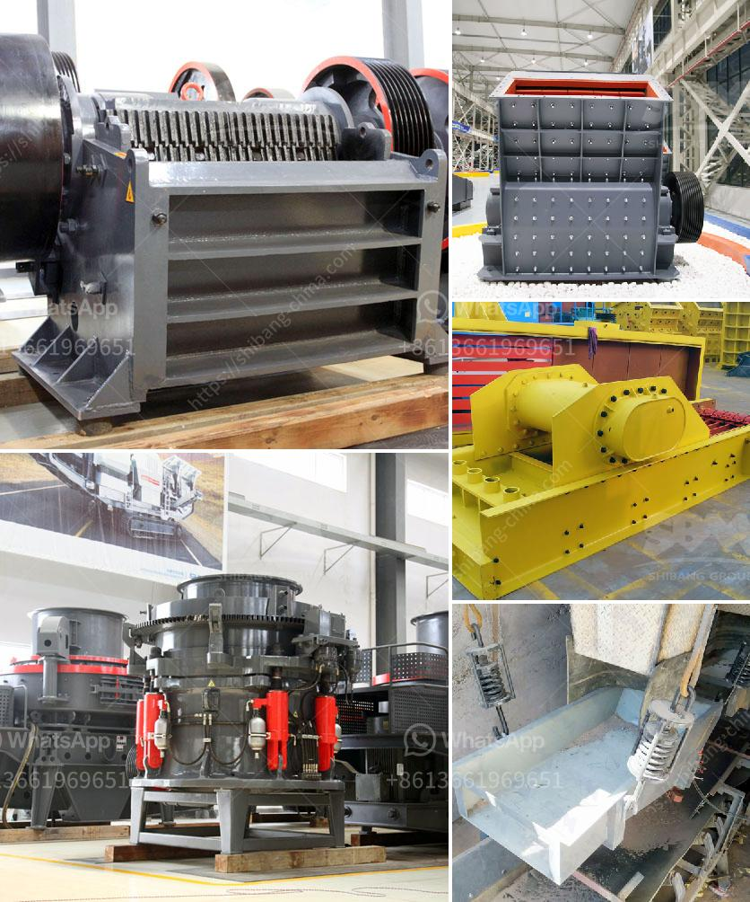

<h3>mining process of mica crusher</h3>
Mica is a mineral widely used in various industries, including cosmetics, paint, and electronics. Its unique properties, such as heat resistance and electrical insulation, make it a valuable resource. However, the extraction process of mica can be challenging and complex. This article provides a step-by-step guide to the mining process of mica crusher.

The first step in the mining process is prospecting and exploration. Geologists carefully study the geological formations and conduct surveys to identify potential mica deposits. This involves analyzing rock samples, conducting ground surveys, and using geophysical techniques like remote sensing.

Once a potential mica deposit is identified, the next step is to prepare the site for mining. This involves clearing vegetation, removing topsoil, and creating access roads to the mining area. The site is also surveyed to determine the best locations for infrastructure, such as crushers and processing plants.

After the site is prepared, drilling and blasting techniques are used to extract mica ore from the ground. Blast holes are drilled into the rock, and explosives are inserted. The controlled detonation breaks up the rock, allowing the mica-bearing ore to be easily extracted.

Once the mica ore is extracted, it is transported to a crusher for initial processing. The crusher reduces the ore into smaller particles, making it easier to handle and transport. Depending on the desired outcome, further grinding and milling may be required to achieve the desired particle size.

After the ore is crushed and ground, the next step is to separate mica from other minerals. This is typically done using a combination of techniques, such as froth flotation, gravity separation, and magnetic separation. Froth flotation involves adding specific chemicals that selectively bind to the mica particles and float them to the surface, where they can be collected.

Once the mica is separated, it is usually dried to reduce moisture content. Drying is done using various methods, such as rotary dryers or fluidized bed dryers. After drying, the mica may undergo further beneficiation processes to improve its quality and remove impurities.

The final step in the mining process of mica crusher is packaging and distribution. The mica is typically packed in bags or containers and labeled for shipment to various industries. A robust quality control process ensures that the mica meets the required specifications before it is distributed to customers.

Overall, the mining process of mica crusher involves several essential steps, from prospecting and exploration to packaging and distribution. Each step requires careful planning and execution to ensure the efficient and sustainable extraction of mica. By following these steps, mining companies can effectively harness the immense potential of mica and provide a valuable resource for various industries.
<h3>Contact us</h3><ul><li><strong>Whatsapp:&nbsp;<a href="https://wa.me/8613661969651">+8613661969651</a></strong></li><li><a href="https://swt.shibang-china.com/?git&amp;zhl&amp;mining process of mica crusher"><strong>Online Service(chat now)</strong></a></li></ul><h3>Related</h3><ul><li><a href='used portable roller crushers and screens scmmining.md'>used portable roller crushers and screens scmmining</a></li><li><a href='petroleum coke process.md'>petroleum coke process</a></li><li><a href='mobile crushing plant for sale.md'>mobile crushing plant for sale</a></li><li><a href='hammer crusher in japan.md'>hammer crusher in japan</a></li><li><a href='gold wash plant trommel for sale in dubai.md'>gold wash plant trommel for sale in dubai</a></li></ul>