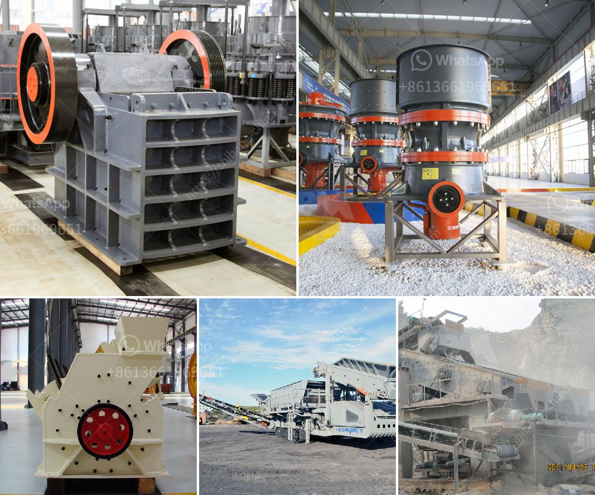

<h3>mobile aggregate crusher</h3>
Mobile aggregate crusher is a key player in many construction projects such as recycling, mining, and quarrying. Undoubtedly, the importance of these machines in these industries has been increasing rapidly thanks to their many benefits. However, to benefit from the advantages efficiently, it is necessary to choose the right machine that is suitable for the specific requirements of the project.

Mobile aggregate crushers come in various types, starting from the basic ones or others that are equipped with advanced features for performing complex operations. The commonly used ones are jaw crushers, cone crushers, impact crushers, and roller crushers. These machines provide different types of aggregate that is ideal for the construction industry.

Aggregate is the loose granular materials in the concrete, which has the function of skeleton and fill. Common aggregate can be classified into coarse aggregate and fine aggregate. The aggregates which particle size is larger than 4.75mm is called coarse aggregate, including gravel, crushed stone, slag, etc. The aggregates which particle size is less than 4.75mm is called fine aggregate, including the fine and medium natural sand, sand, fly ash. These are the raw materials for the production of concrete, and are used for making various parts of concrete, such as reinforcing steel bars, concrete floor slabs, beams, columns, foundations, etc. in construction engineering.

The mobile crusher is equipped with screens that allow the aggregate size to be separated into different levels. Usually, the mobile crusher has an upper sieve opening of 30mm to 130mm. It can be adjusted according to actual production needs. The crushing equipment is popular among construction companies for its versatility and mobility.

The mobile jaw crusher is equipped with a special wobbler feeder for prescreening to permit thorough screening of cohesive feed material. Since summer 2020, the rockster R1100DS impactor with screen box and return belt has been creating valuable aggregate for CSB Mobile. The easy handling and good performance of the crusher as well as the possibility of processing various materials were key criteria for the purchase.

Mobile cone crushing plant that manufactured by Shanghai Oriental Machinery is popular in the market, sales oriented, & brings its benefits. This feature makes it ideal for use in a bustling construction site, crowded roads, or a quarry. Besides, it can also be used in aggregate production, recycling, demolition, and infrastructure projects. It has the ability to be moved around easily, as well as being fully operational in minutes, due to its hydraulic opening capability.

A mobile impact crusher is a machine that pulverizes large-sized solid materials into smaller ones. In the first step, the materials are impacted by high-speed impact plates. After being repeatedly impacted and crushed, they bounce back to the active area of the plates and are further impacted, then extruded through the gap between the plates. While large-sized materials are still being impacted and crushed again, then again extruded to the lower part of the plates to be further crushed until there is no material qualified to be discharged.

Mobile roller crushers are used for the brittle and soft materials such as coal and salt. They pull in pieces that are only two-thirds the size of the roller. Compared to the jaw crusher, the roller crusher has a simple structure and fewer parts, making it less prone to breaking down.

In conclusion, with the increasing demand for construction materials, mobile crushers play an important role in the mining and construction industry. By choosing the right machine for the job, you can ensure efficiency, maximize productivity, and increase profitability for your business.
<h3>Contact us</h3><ul><li><strong>Whatsapp:&nbsp;<a href="https://wa.me/8613661969651">+8613661969651</a></strong></li><li><a href="https://swt.shibang-china.com/?git&amp;zhl&amp;mobile aggregate crusher"><strong>Online Service(chat now)</strong></a></li></ul><h3>Related</h3><ul><li><a href='crusher stone price.md'>crusher stone price</a></li><li><a href='mica powder making.md'>mica powder making</a></li><li><a href='looking for kaolin processing price.md'>looking for kaolin processing price</a></li><li><a href='complete stone crusher plant manufacturer from italy.md'>complete stone crusher plant manufacturer from italy</a></li><li><a href='crusher manufacturer in pune ie.md'>crusher manufacturer in pune ie</a></li></ul>