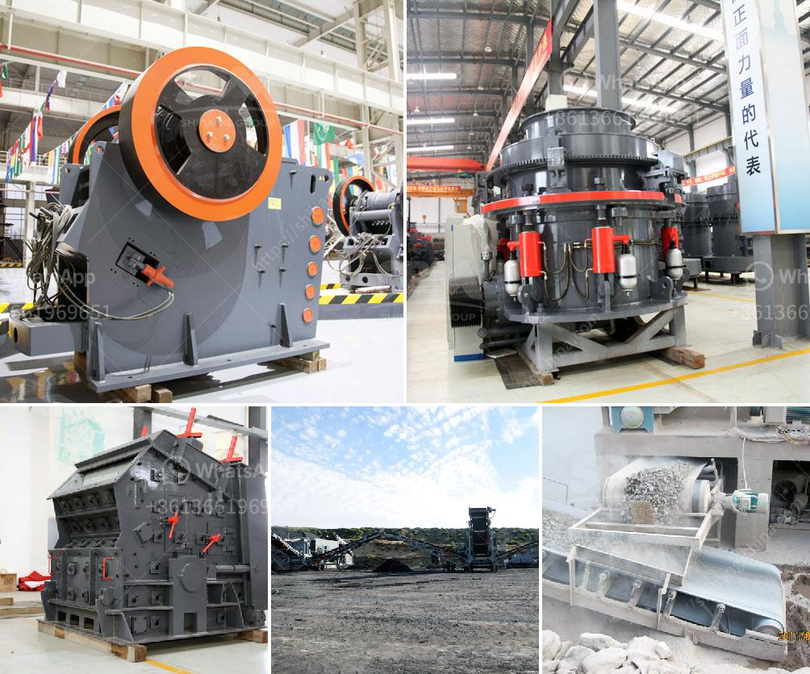

<h3>mobile cil gold processing plant</h3>
Mobile CIL (carbon-in-leach) gold processing plants are a modern way to extract gold from ore using activated carbon. These plants are compact, easy to operate, and highly mobile, making them perfect for remote locations where traditional gold processing plants are not viable.

Traditional gold processing plants typically consist of major equipment such as crushing, grinding, leaching, and gold recovery circuits, along with waste disposal systems. While effective, these plants are often large and stationary, requiring significant capital investment and infrastructure. This limits their use to areas with the necessary infrastructure and readily accessible gold deposits.

Mobile CIL gold processing plants offer a solution to these limitations. They can be transported to a site and set up within a short period, enabling quick gold production in remote areas. The compact design of these plants allows for easy transportation, making them ideal for mining operations in difficult terrains or areas with limited infrastructure.

The key component of a mobile CIL gold processing plant is the activated carbon system. The carbon capture and recovery system traps the dissolved gold from the leaching process, allowing for efficient gold recovery. The activated carbon is then regenerated, ensuring its longevity and effectiveness.

Mobile CIL gold processing plants offer several advantages over traditional gold processing plants. Firstly, they eliminate the need for costly and time-consuming infrastructure development, as they can be easily transported and set up in any location. This reduces the overall project costs and increases the return on investment for smaller scale mining operations.

Secondly, the compact size of mobile CIL gold processing plants ensures minimal environmental impact. Unlike large-scale plants, there is no need for extensive waste disposal systems, as the plant produces limited waste products. This makes them an environmentally friendly option for gold processing.

Additionally, mobile CIL gold processing plants can be custom-designed to suit specific site requirements. This flexibility allows for tailoring the plant to the characteristics of the ore, maximizing gold recovery and efficiency. The modular design also enables easy scalability, allowing for increased production as required.

These plants have seen success in various regions worldwide, particularly in Africa, where they have played a crucial role in increasing gold production in remote areas. Mobile CIL gold processing plants have enabled small-scale miners to efficiently extract gold, boosting local economies and reducing reliance on traditional methods of gold extraction.

In conclusion, mobile CIL gold processing plants are a modern and efficient solution to gold extraction in remote and challenging environments. Their compact design, ease of transportation, and customizable features make them a cost-effective option for small-scale mining operations. The benefits of mobile CIL gold processing plants include reduced infrastructure requirements, minimal environmental impact, and increased gold recovery rates. These plants have revolutionized the gold mining industry, opening new opportunities for sustainable and responsible mining practices.
<h3>Contact us</h3><ul><li><strong>Whatsapp:&nbsp;<a href="https://wa.me/8613661969651">+8613661969651</a></strong></li><li><a href="https://swt.shibang-china.com/?git&amp;zhl&amp;mobile cil gold processing plant"><strong>Online Service(chat now)</strong></a></li></ul><h3>Related</h3><ul><li><a href='coal machines for sale in south africa.md'>coal machines for sale in south africa</a></li><li><a href='total power for jaw crusher 500 tph.md'>total power for jaw crusher 500 tph</a></li><li><a href='dolomite grinding mill for sale in india.md'>dolomite grinding mill for sale in india</a></li><li><a href='used mining equipment uk.md'>used mining equipment uk</a></li><li><a href='small scale gold mining equipment in south africa.md'>small scale gold mining equipment in south africa</a></li></ul>