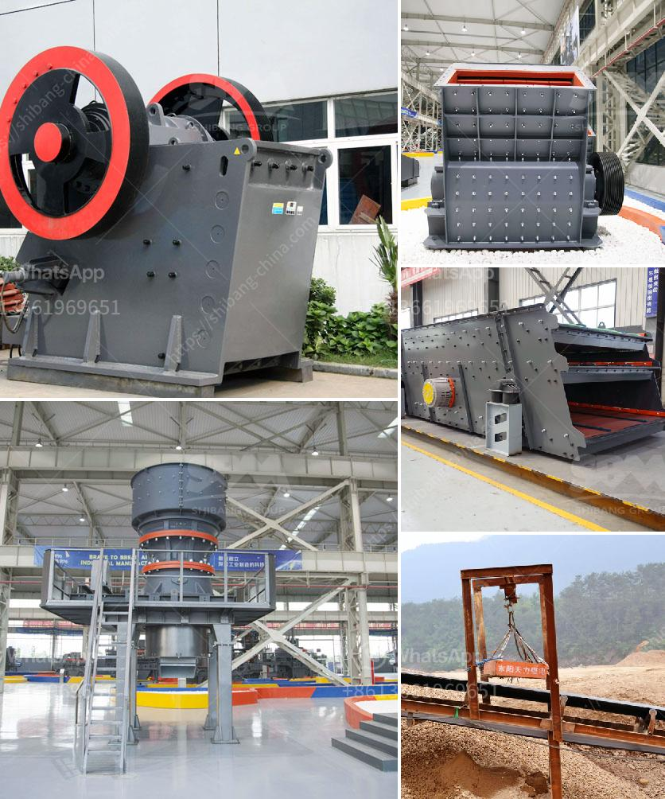

<h3>mobile coal crusher for sale in south africa</h3>
In recent years, the mobile coal crusher for sale in South Africa has been rapidly developed. With the rapid development of the economy in South Africa, the infrastructure construction is booming and the market for the mobile coal crusher for sale in South Africa is also expanding. The equipment used in any workplace must be durable and easy to maintain. As for the South Africa market, many customers will choose various mobile coal crusher equipment, such as the mobile cone crusher, mobile impact crusher, and so on.

Nowadays, mobile coal crushing equipment has become a trend in South Africa. With the development of technology and the increase in demand for machine sand, the mobile coal crusher developed by Chang Lei is targeted at the South African coal market. Moreover, the production cost of the equipment is low, so it can greatly reduce investment costs. The mobile coal crusher plant can eliminate the obstacles of the crushing places and circumstances, and offer the high efficiency and low cost project plants for the client, which are developed according to the various needs of clients.

To understand the South African coal crusher market, it is necessary to first understand the basic needs of the South African coal crusher market. South African coal crushing equipment includes jaw crushers, cone crushers, vertical shaft impact crushers, hammer crushers, etc. Mobile coal crusher performance characteristics

5. Due to the environment of coal processing plants, there will be some exhaust gases and dust emissions during the production process, but the environmental protection measures can be taken to reduce the environmental pollution of the coal crushing plant.

The mobile coal crusher is a convenient and flexible secondary crushing equipment produced by our company according to the needs of the South African coal market and customers, and is also helpful for the processing and utilization of coal resources. In addition, the mobile coal crusher is excellent value for money, and equipment with a low maintenance rate is essential, so that customers can save a lot of maintenance costs. With the rapid development of the South African economy, the demand for coal is also increasing, and users are looking for a cost-effective coal crusher to process coal effectively. The mobile coal crusher is the best choice.
<h3>Contact us</h3><ul><li><strong>Whatsapp:&nbsp;<a href="https://wa.me/8613661969651">+8613661969651</a></strong></li><li><a href="https://swt.shibang-china.com/?git&amp;zhl&amp;mobile coal crusher for sale in south africa"><strong>Online Service(chat now)</strong></a></li></ul><h3>Related</h3><ul><li><a href='gravel and sand supply business plan pdf.md'>gravel and sand supply business plan pdf</a></li><li><a href='sample of joint operations agreement quarry mining.md'>sample of joint operations agreement quarry mining</a></li><li><a href='quartz silica crusher plant sale at telangana.md'>quartz silica crusher plant sale at telangana</a></li><li><a href='vibrating screen price.md'>vibrating screen price</a></li><li><a href='quarry crusher equipment process.md'>quarry crusher equipment process</a></li></ul>