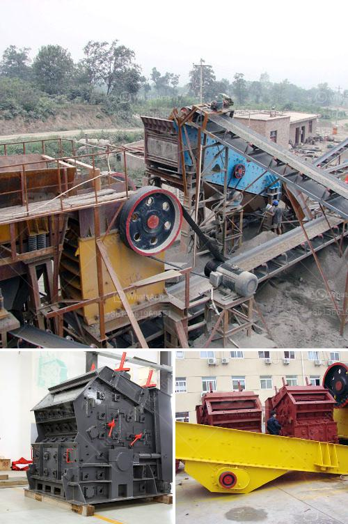

<h3>mobile crusher and screening plant</h3>
The rise of mobile crushers and screening plants has been a game-changer for the construction industry. With the convenience of these machines, construction managers have been able to access mineral deposits, remote sites, and handle a wide range of materials with ease. In this article, we will explore the features and benefits of mobile crushers and screening plants.

A mobile crusher is a machine designed to reduce large rocks into smaller rocks, gravel, or rock dust. Crushers can be used to reduce the size or change the form of waste materials so they can be more easily disposed of or recycled, or to reduce the size of a solid mix of raw materials (as in rock ore), so that pieces of different composition can be differentiated. Crushing is the process of transferring a force amplified by mechanical advantage through a material made of molecules that bond together more strongly, and resist deformation more, than those in the material being crushed do.

One of the main advantages of mobile crushers is their flexibility. They can be transported from one site to another as needed, which eliminates the need for costly transportation of materials. This also allows for easy access to remote sites and deeper mining areas where the transport of material is challenging. Additionally, mobile crushers can be taken away from the construction site when the project is completed, reducing the environmental impact.

Furthermore, mobile crushers and screening plants are ideal for recycling construction waste, such as asphalt, concrete, and demolition waste. This not only helps to reduce the environmental impact of construction but also saves money on the disposal of waste materials. The processed materials can be reused in future construction projects, reducing the demand for new materials and conserving natural resources.

The screening plant part of the mobile crusher and screening plant combination is designed to separate the crushed material into different sizes for further processing. The screening plant can be equipped with different types of screens, such as vibrating screens, grizzly screens, or trommel screens, depending on the desired output material size and capacity. The different screen sizes allow for the production of various grades of aggregate, which is crucial in construction projects.

The combination of a mobile crusher and screening plant also improves efficiency in material handling. Instead of manually loading and unloading materials, the plant allows for continuous operation, reducing downtime and increasing productivity. This is especially beneficial in large-scale construction projects where a high volume of material needs to be processed.

In conclusion, mobile crushers and screening plants have revolutionized the construction industry by providing a flexible, efficient, and environmentally friendly solution for processing various materials on-site. Their ability to be transported easily and handle a wide range of materials make these machines a valuable asset for construction managers. Furthermore, the recycling capabilities of mobile crushers and screening plants contribute to sustainable construction practices. With these advancements, it is clear that mobile crushers and screening plants are here to stay and will continue to play a vital role in the construction industry.
<h3>Contact us</h3><ul><li><strong>Whatsapp:&nbsp;<a href="https://wa.me/8613661969651">+8613661969651</a></strong></li><li><a href="https://swt.shibang-china.com/?git&amp;zhl&amp;mobile crusher and screening plant"><strong>Online Service(chat now)</strong></a></li></ul><h3>Related</h3><ul><li><a href='small rock crushers for recreation.md'>small rock crushers for recreation</a></li><li><a href='mobile crushing plant manufacturers.md'>mobile crushing plant manufacturers</a></li><li><a href='quarry stone crushers for sale.md'>quarry stone crushers for sale</a></li><li><a href='stone crusher in sri lanka.md'>stone crusher in sri lanka</a></li><li><a href='turkey project gypsum powder production line.md'>turkey project gypsum powder production line</a></li></ul>