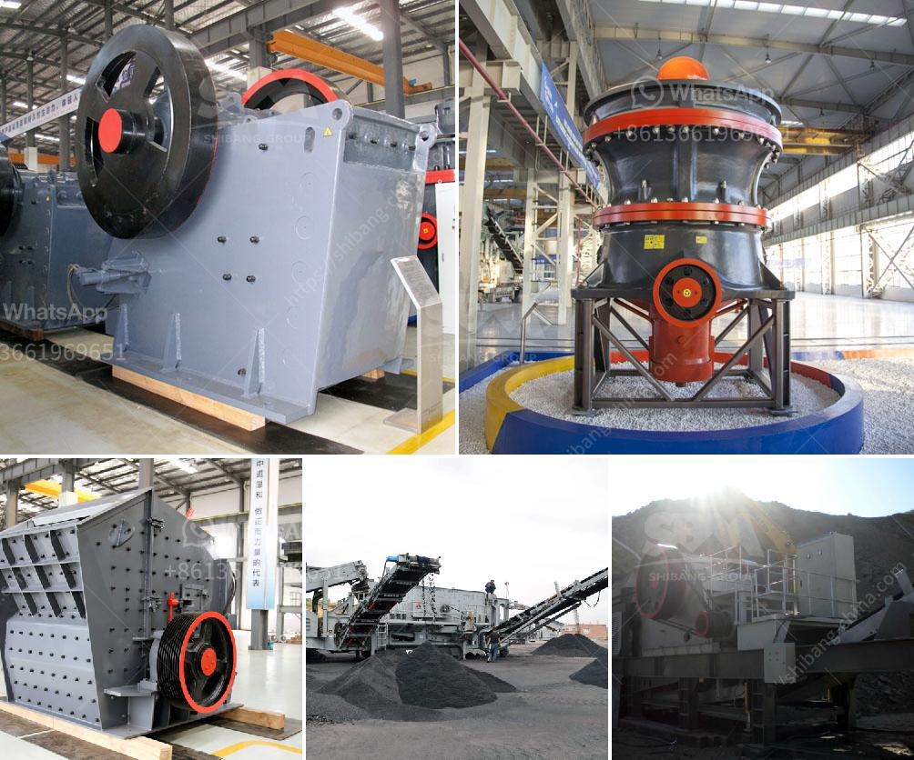

<h3>mobile crusher capacity per hour</h3>
Mobile crusher is a crushing machine that is used to crush rocks and other hard materials. It is widely used in various sectors like mining, quarry, cement, building material, metallurgy, and chemical industry.

As the most commonly used crushing equipment, mobile crusher can process a variety of materials, such as ore, pebbles, gravel, rock, limestone, granite, basalt, diabase, etc. It is particularly suitable for crushing hard rocks such as taconite, granite, dark rock, corundum, quartzite, etc.

One of the key features of mobile crushers is their high flexibility and high mobility, which enables them to move from one site to another easily. This greatly reduces the transportation costs and saves a lot of time. In addition, mobile crushers can work independently or together with other crushing and screening equipment, forming a complete mobile crushing plant.

The mobile crusher capacity per hour can vary greatly depending on the model and size of the machine. There are three main factors that influence the capacity:

1. The feeding size: The larger the size of the feeding material, the more time it takes to be crushed. Therefore, a mobile crusher with a larger feeding size will have a higher capacity.

2. The discharge size: The smaller the size of the discharge material, the more times it needs to be crushed. A mobile crusher that can produce smaller size material will have a higher capacity.

3. The hardness and density of the material: Harder and denser materials require more energy and time to crush. Therefore, a mobile crusher that can crush harder and denser materials will have a higher capacity.

Most mobile crushers have a capacity range of 60 to 500 tons per hour. The maximum capacity reported by most mobile crushers is slightly above 2,000 tons per hour. For example, the mobile impact crusher Mobirex MR 130 Zi EVO2 weighs less than 130 tons and processes up to 450 tons per hour.

The mobile jaw crusher Mobirex MR 110 Zi EVO2 weighs around 43 tons and processes up to 350 tons per hour.

The mobile cone crusher Mobicone MCO 13 S has a weight of around 60 tons and processes up to 600 tons per hour.

The powerful impact crusher Mobirex MR 110 Z EVO2 weighs around 70 tons and processes up to 350 tons of material per hour.

With such high capacities, it is crucial to choose the right mobile crusher that suits your needs. It is recommended to consult with experts or manufacturers to ensure that you select the appropriate mobile crusher with the desired capacity.

In conclusion, mobile crushers are highly efficient machines with high crushing capacities. They have become an essential part of the mining, quarry, and construction industries due to their flexibility, mobility, and high processing capacity. However, it is important to consider factors such as feeding size, discharge size, and material hardness when selecting a mobile crusher to optimize its capacity.
<h3>Contact us</h3><ul><li><strong>Whatsapp:&nbsp;<a href="https://wa.me/8613661969651">+8613661969651</a></strong></li><li><a href="https://swt.shibang-china.com/?git&amp;zhl&amp;mobile crusher capacity per hour"><strong>Online Service(chat now)</strong></a></li></ul><h3>Related</h3><ul><li><a href='portable impact crushers.md'>portable impact crushers</a></li><li><a href='raymond mill for grinding gypsum.md'>raymond mill for grinding gypsum</a></li><li><a href='chrome ore ferro chrome plant construction plants.md'>chrome ore ferro chrome plant construction plants</a></li><li><a href='companies of conveyor belts in mexico.md'>companies of conveyor belts in mexico</a></li><li><a href='crusherstone machine in china.md'>crusherstone machine in china</a></li></ul>