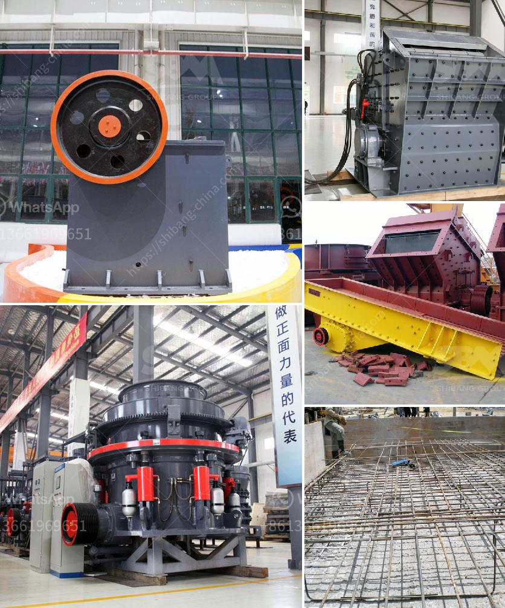

<h3>mobile crusher for</h3>
In today's world of rapidly advancing technology, it has become imperative to find efficient solutions for various industries. One industry that greatly benefits from technological advancements is construction. With the introduction of mobile crushers, construction sites can now easily process materials on-site, enhancing efficiency and reducing transportation costs.

Mobile crushers are portable machines used to crush rocks and stones into smaller sizes for various construction purposes. They are equipped with advanced technologies to perform tasks such as crushing concrete, asphalt, demolition waste, and natural rock. These machines are highly flexible and can be transported easily to any location, allowing construction companies to process materials directly on-site.

One of the key advantages of mobile crushers is the reduction in transportation costs. In traditional crushers, the materials need to be transported to a centralized location, which can be far from the construction site. This requires heavy-duty vehicles and additional manpower, resulting in high transportation costs. On the other hand, mobile crushers eliminate the need for transportation as they can be directly operated on-site, saving time and money.

Another benefit of mobile crushers is their versatility. These machines can handle various types of materials and can be adjusted to produce different sizes as needed. Whether it is concrete, asphalt, or natural rock, mobile crushers can easily process them to meet the specific requirements of a construction project. Moreover, they can be equipped with additional attachments such as screens and conveyors, further enhancing their efficiency and productivity.

Mobile crushers also contribute to the reduction of environmental impact. By processing materials directly on-site, there is a decrease in the amount of waste being transported to landfills. Additionally, mobile crushers use less energy compared to traditional crushers, making them more environmentally friendly. This aspect is crucial in the construction industry, as sustainability and responsible waste management are becoming increasingly important.

One of the leading mobile crusher manufacturers, Zenith, offers a wide range of machines tailored to meet the specific needs of construction companies. Their mobile crushers are equipped with advanced features such as hydraulic systems, remote control operation, and wireless communication for real-time monitoring. These technologies make the operation of these machines safer, more efficient, and easier to track and maintain.

In conclusion, mobile crushers are the perfect tool for construction sites. They offer numerous benefits such as reduced transportation costs, improved productivity, versatility, and a smaller environmental footprint. With their advanced technologies and flexible operation, they can effectively process materials on-site, making them an essential asset for any construction project. As technology continues to advance, it is expected that mobile crushers will play an even more significant role in the construction industry, revolutionizing the way materials are processed and contributing to a more sustainable future.
<h3>Contact us</h3><ul><li><strong>Whatsapp:&nbsp;<a href="https://wa.me/8613661969651">+8613661969651</a></strong></li><li><a href="https://swt.shibang-china.com/?git&amp;zhl&amp;mobile crusher for"><strong>Online Service(chat now)</strong></a></li></ul><h3>Related</h3><ul><li><a href='chrome ore crushers and screeners for hire in south africa.md'>chrome ore crushers and screeners for hire in south africa</a></li><li><a href='stone grinder machines for sale usa.md'>stone grinder machines for sale usa</a></li><li><a href='top 10 stone crusher companies in india.md'>top 10 stone crusher companies in india</a></li><li><a href='setting up of a stone quarry plant in nigeria.md'>setting up of a stone quarry plant in nigeria</a></li><li><a href='cost of a primairy crusher.md'>cost of a primairy crusher</a></li></ul>