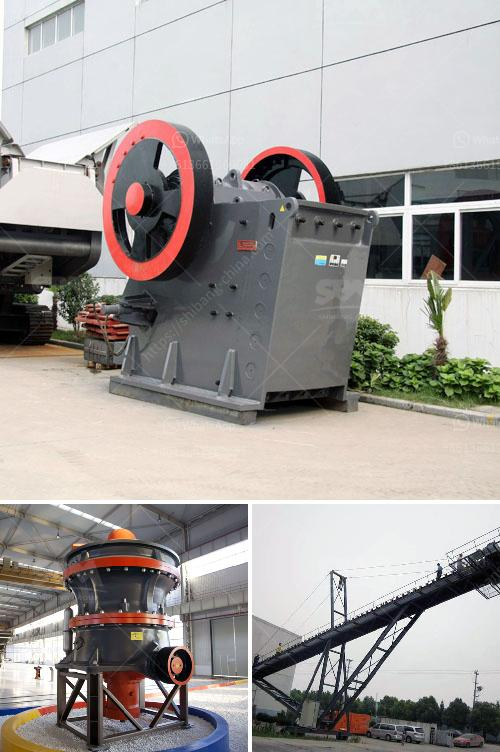

<h3>mobile crusher in fiji</h3>
In recent years, with the development of construction industry, the demolition of old buildings and infrastructure has become a real headache for governments worldwide. It is not only costly but also time-consuming and environmentally unfriendly. However, thanks to the introduction of mobile crushers, these issues have been effectively addressed, especially in countries like Fiji where infrastructure development is rapidly progressing.

Mobile crushers are key equipment for rock crushing, recycling of construction waste, and primary crushing of mining material. They are widely used in mining, metallurgy, building materials, and energy industries. With the advancement of technology and the increasing demand for mobile crushers in Fiji, manufacturers have started producing a variety of mobile crushers to cater to different needs.

One of the significant advantages of mobile crushers is that they can move to various job sites with ease. They can be transported to the construction site or mining area quickly, allowing for efficient and immediate crushing of rocks or recycling of materials on-site. In Fiji, where large-scale infrastructure projects are underway, having mobile crushers at these sites saves valuable time and resources that would otherwise be spent on transporting heavy machinery.

Furthermore, mobile crushers are environmentally friendly. They greatly reduce the pollution caused by traditional crushing equipment. As they are equipped with advanced dust suppression systems, these crushers minimize dust emissions and noise levels during operation. This is particularly crucial in densely populated areas, as well as in Fiji, where people's health and environmental preservation are top priorities.

Another notable benefit of mobile crushers is their versatility. They can handle a wide range of materials, from natural rocks to demolition waste. Moreover, different attachments can be added to the crushers, such as screening buckets or demolition tools, to further enhance their capabilities. This versatility makes them suitable for various applications, from road construction to recycling projects in Fiji.

However, it is essential to realize that the success of utilizing mobile crushers in Fiji depends on proper planning and site preparation. A thorough assessment of the site's conditions, including the type of material to be crushed and its hardness, is essential. Additionally, careful consideration must be given to the required capacity, power supply, and maintenance requirements of the mobile crusher.

In conclusion, mobile crushers have revolutionized the construction and mining industries, offering numerous benefits in terms of time and cost savings, environmental friendliness, and versatility. In Fiji, where infrastructure development is booming, these crushers have become indispensable for the efficient and sustainable progress of projects. However, it is crucial to carefully evaluate the specific needs and requirements of each project before selecting and implementing a mobile crusher. With proper planning and use, mobile crushers will undoubtedly continue to play a crucial role in driving Fiji's construction industry forward.
<h3>Contact us</h3><ul><li><strong>Whatsapp:&nbsp;<a href="https://wa.me/8613661969651">+8613661969651</a></strong></li><li><a href="https://swt.shibang-china.com/?git&amp;zhl&amp;mobile crusher in fiji"><strong>Online Service(chat now)</strong></a></li></ul><h3>Related</h3><ul><li><a href='hammer crusher buhler miag titan.md'>hammer crusher buhler miag titan</a></li><li><a href='silica sand import in europe.md'>silica sand import in europe</a></li><li><a href='lm vertical grinding mill.md'>lm vertical grinding mill</a></li><li><a href='coal crusher types.md'>coal crusher types</a></li><li><a href='denver ball mills.md'>denver ball mills</a></li></ul>