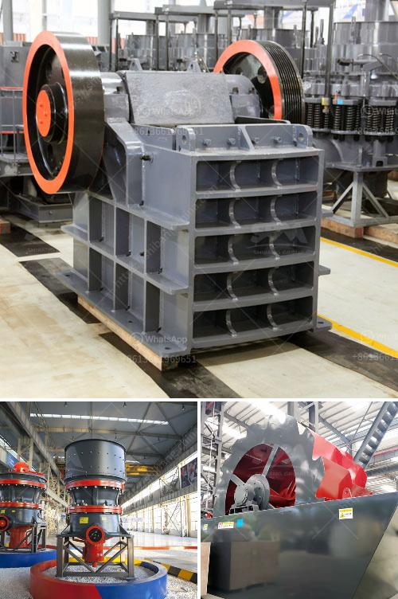

<h3>mobile crusher india</h3>
The use of mobile crushers is rapidly gaining popularity in India. Mobile crushers are considered as essential tools in the mining and construction industry. They are versatile and can be used for crushing various types of materials such as rocks, marbles, iron ore, granite, and copper ore.

1. Flexibility and Convenience: Mobile crushers are compact in size, which allows them to be easily transported from one location to another. This makes them highly versatile and suitable for working in various terrains. Whether it is a construction site or a quarry, mobile crushers can be quickly deployed and set up for efficient crushing.

2. Cost-Effective: Mobile crushers are relatively cost-effective compared to stationary crushing plants. They eliminate the need for expensive foundations and infrastructure, resulting in significant savings in terms of construction costs. In addition, mobile crushers consume less fuel, reducing operational costs.

3. Increased Productivity: With mobile crushers, operators can quickly and efficiently move the crushing equipment closer to the desired material source. This reduces the time and effort required to transport large quantities of material to a stationary plant. As a result, the productivity of the entire operation is greatly enhanced.

4. Environmental Benefits: Mobile crushers are equipped with advanced technologies such as exhaust gas scrubbers, dust suppression systems, and noise reduction features. These measures help in minimizing the environmental impact of the crushing process. In addition, the use of mobile crushers reduces the need for road transportation, resulting in lower carbon emissions.

5. Wide Range of Applications: Mobile crushers are suitable for various applications, including mining, quarrying, recycling, and construction. From crushing hard rocks to processing construction waste, mobile crushers offer a solution for a wide range of material types.

In conclusion, the use of mobile crushers in India offers numerous benefits, including flexibility, cost-effectiveness, increased productivity, environmental friendliness, and a wide range of applications. As the demand for aggregates and construction materials continues to grow, mobile crushing and screening plants are expected to play a pivotal role in meeting these demands.
<h3>Contact us</h3><ul><li><strong>Whatsapp:&nbsp;<a href="https://wa.me/8613661969651">+8613661969651</a></strong></li><li><a href="https://swt.shibang-china.com/?git&amp;zhl&amp;mobile crusher india"><strong>Online Service(chat now)</strong></a></li></ul><h3>Related</h3><ul><li><a href='ball mill inching drive.md'>ball mill inching drive</a></li><li><a href='stone crusher price of 30 tons per hour.md'>stone crusher price of 30 tons per hour</a></li><li><a href='stone crushing plant leaves in uganda.md'>stone crushing plant leaves in uganda</a></li><li><a href='second hand diamond dms plant for sale kimberly.md'>second hand diamond dms plant for sale kimberly</a></li><li><a href='price of a vibrating screen.md'>price of a vibrating screen</a></li></ul>