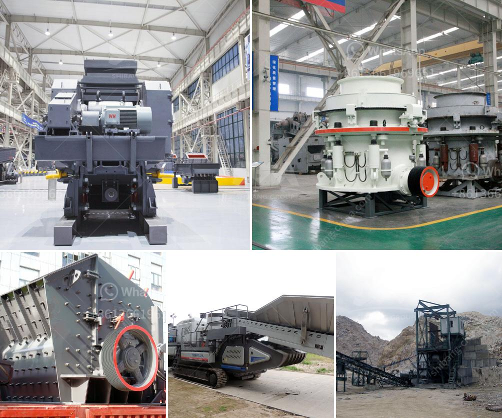

<h3>mobile crusher machine</h3>
Mobile crusher is a machine designed for both crushing and recycling materials directly on a job-site and it has become an essential tool in the mining, construction and quarry industry in the recent years.

With the advancement in technology, it has become quite easy to manufacture and operate mobile crushers which are gaining immense popularity due to their versatility and ease of relocation. The mobile crushers are widely used in the mining industry for the processing of materials such as metallurgical ores, building materials and demolition waste.

One of the key benefits of using a mobile crusher machine is the reduction in overall transportation costs. Unlike traditional crushers, such as jaw crushers or impact crushers, a mobile crusher allows the user to crush materials directly at the job site, thus reducing the need for hauling materials, ultimately saving on transportation costs. This is especially advantageous for mining and construction sites located in remote areas where transportation may be costly and time-consuming.

The mobile crusher machine is equipped with advanced technology and machinery and is capable of processing a wide range of materials, including C&D waste, natural stone, glass, coal, reinforced concrete and much more. The efficient screening and crushing process ensures the highest level of product quality and reduces wastage.

Furthermore, the mobility of the mobile crusher machine allows it to be easily transported between job sites. It can be quickly set up and dismantled, making it highly flexible and adaptable. This mobility also enables the crusher to be used in various applications and industries, thus increasing its overall efficiency and productivity.

In addition to its versatility and mobility, the mobile crusher machine offers many other advantages. It is equipped with advanced safety features, ensuring the safety of workers and reducing the risk of accidents. The machine also has low emissions and noise levels, making it environmentally friendly and compliant with regulations.

The mobile crusher machine is available in various models and sizes to cater to the specific needs of different industries and applications. Whether it is a small construction project or a large-scale mining operation, there is a mobile crusher machine suitable for the job.

Overall, the mobile crusher machine is a perfect example of technological advancements in the mining and construction industry. Its versatility, mobility, and efficiency make it an essential tool for any job site. Its ability to process a wide range of materials and reduce transportation costs makes it a cost-effective solution for businesses.

In conclusion, mobile crusher machines have revolutionized the mining and construction industry by providing an efficient and cost-effective solution for crushing and recycling materials. With their advanced technology and mobility, these machines have become an indispensable tool for any job site.
<h3>Contact us</h3><ul><li><strong>Whatsapp:&nbsp;<a href="https://wa.me/8613661969651">+8613661969651</a></strong></li><li><a href="https://swt.shibang-china.com/?git&amp;zhl&amp;mobile crusher machine"><strong>Online Service(chat now)</strong></a></li></ul><h3>Related</h3><ul><li><a href='calcium carbonate plant in bulacan.md'>calcium carbonate plant in bulacan</a></li><li><a href='gold crusher for sale in brazil.md'>gold crusher for sale in brazil</a></li><li><a href='mobile crushing and screening.md'>mobile crushing and screening</a></li><li><a href='price of ceramic making machine in india.md'>price of ceramic making machine in india</a></li><li><a href='magnesium carbonate plant layout.md'>magnesium carbonate plant layout</a></li></ul>