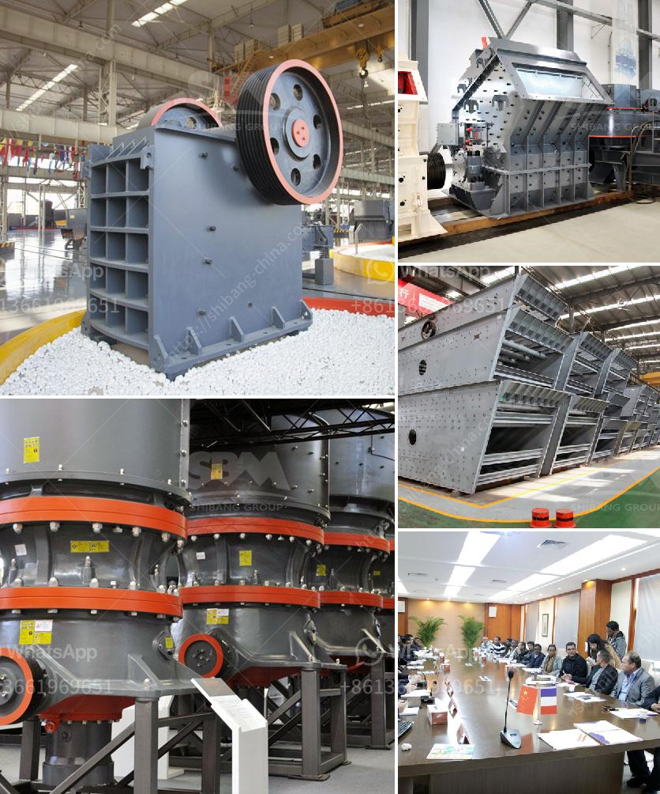

<h3>mobile crusher malaysia for sell</h3>
Malaysia is rich in mineral resources, and it is one of the world's top ten producers of natural rubber, palm oil, tin, crude oil, and copper. Historically, the mining industry in Malaysia has played a crucial role in the country's economic development. It has contributed significantly to the GDP and provided employment opportunities for thousands of people. With the growing demand for minerals and resources, a mobile crusher becomes increasingly important for mining and quarrying businesses.

There are many different types of mobile crushers in the market, such as jaw crushers, cone crushers, impact crushers, and many others. They can process various materials, ranging from hard stones to ore, minerals, construction waste, and more.

One of the key benefits of using a mobile crusher is its mobility. It can travel to any site and process stone or demolition materials on-site to save transportation costs and time. Additionally, a mobile crusher eliminates the need for costly infrastructure such as concrete foundations and roads, making it a cost-effective solution for businesses.

Mobile crushers are also known for their high performance and versatility. They can be used in various applications, such as primary crushing, secondary crushing, and tertiary crushing. Depending on the specific requirements of the project, mobile crushers can be equipped with different crushing chambers to optimize their performance and meet the desired output.

Furthermore, mobile crushers are equipped with advanced technologies to ensure efficient operation and high productivity. Features such as automatic feeding system, hydraulic adjustment, and overload protection system contribute to the ease of use and safety of mobile crushers.

In Malaysia, the infrastructure construction has been thriving due to the rapid urbanization and industrialization projects in the country. As a result, the demand for mobile crushers is increasing to meet the growing needs.

To cater to this demand, various suppliers and manufacturers have emerged in the market. They offer a wide range of mobile crushers, catering to different requirements and budgets. These crushers are available for sale in Malaysia and can be purchased either online or through traditional channels.

When purchasing a mobile crusher in Malaysia, it is important to consider factors such as the size of the machine and its capabilities. Additionally, the reputation and after-sales support of the manufacturer should be taken into account to ensure a smooth and reliable purchasing experience.

Mobile crushers have revolutionized the mining and quarrying industry by providing a flexible and cost-effective solution for crushing on-site. Their mobility, high performance, and versatility make them an essential tool for businesses in Malaysia's minerals and resources sector.

If you are a mining or quarrying business in Malaysia, investing in a mobile crusher can greatly enhance your productivity and efficiency. With the wide range of options available in the market, you can find the perfect mobile crusher that meets your specific requirements and budget.

So, don't miss out on the opportunity to increase your profitability and streamline your operations. Consider investing in a mobile crusher Malaysia for sell and take your business to new heights.
<h3>Contact us</h3><ul><li><strong>Whatsapp:&nbsp;<a href="https://wa.me/8613661969651">+8613661969651</a></strong></li><li><a href="https://swt.shibang-china.com/?git&amp;zhl&amp;mobile crusher malaysia for sell"><strong>Online Service(chat now)</strong></a></li></ul><h3>Related</h3><ul><li><a href='how much does gold mining licences in nigeria.md'>how much does gold mining licences in nigeria</a></li><li><a href='aggregate crusher 200 meter capacity.md'>aggregate crusher 200 meter capacity</a></li><li><a href='mobile crushing and screening contractors south africa.md'>mobile crushing and screening contractors south africa</a></li><li><a href='project report on m sand.md'>project report on m sand</a></li><li><a href='grinding ball for ball mills.md'>grinding ball for ball mills</a></li></ul>