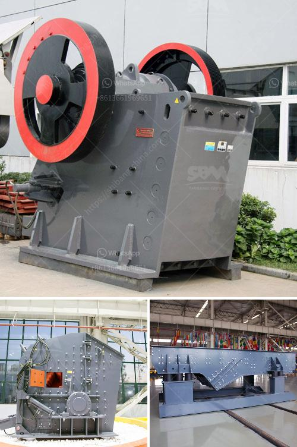

<h3>mobile crusher on rent for iron ore</h3>
Mobile crusher rental services for crushing stones, limestones, basalt, coal, iron ore, rock (oreplus.in)

We provide rental services for mobile crushers in India for crushing of stones, basalt, limestones, coal, iron ore, etc. We are specialized in providing services for crushing and screening and are providing service and support for mining and resources industries by provision of crushing, screening and conveying equipments on contract basis.

We provide one-stop solution for all your crushing needs, with our mobile crushers available for rental. Our entire fleet of crushers is equipped with state-of-the-art machinery to crush and screen materials.

Our crushers are available for rent and come with a team of experienced operators. We ensure our mobile crushers are of high quality and built to last. They are built for durability and withstand heavy use and tough materials.

Mobile crushers have revolutionized the mining industry, thanks to their mobility and versatility. They can be used for various crushing applications, from primary crushing operations to the secondary and tertiary crushing stages. This flexibility allows the mobile crusher to meet different material requirements, making it suitable for both short-term and long-term projects.

Mobile crushers are particularly suitable for crushing iron ore and iron ore fines with different material sizes. Mobile crushers can be used for primary crushing, secondary crushing, and tertiary crushing, as well as screening and conveying. The mobile crusher can be operated independently or as a complete mobile crusher plant, which is particularly useful for working in a place where fixed facilities can't be used, such as at the iron ore mines site.

Mobile crushers can be easily transported from one site to another, making them the perfect choice for temporary projects. In addition, maintenance and repair costs are reduced thanks to the mobile crusher's excellent reliability and durability.

Renting a mobile crusher can be financially beneficial for mining operations, as it eliminates the need for costly transportation and infrastructure for fixed crusher installations. It also allows for greater flexibility in terms of the location of the crushing operation, as the mobile crusher can be easily moved around to different sites.

In conclusion, renting a mobile crusher for iron ore should be a wise choice as it saves a substantial amount of time and money. It also facilitates the efficient utilization of resources and reduces the carbon footprint. Hence, it is becoming increasingly popular among the mining industry to rent a mobile crusher for iron ore crushing.

If you are interested in renting a mobile crusher for iron ore crushing, please contact us. We have a wide range of mobile crushers available for rent and can provide you with a customized solution to meet your specific requirements.
<h3>Contact us</h3><ul><li><strong>Whatsapp:&nbsp;<a href="https://wa.me/8613661969651">+8613661969651</a></strong></li><li><a href="https://swt.shibang-china.com/?git&amp;zhl&amp;mobile crusher on rent for iron ore"><strong>Online Service(chat now)</strong></a></li></ul><h3>Related</h3><ul><li><a href='production process of calcium carbonate.md'>production process of calcium carbonate</a></li><li><a href='mobile jaw crushers for sale in italy.md'>mobile jaw crushers for sale in italy</a></li><li><a href='stone crusher manufacturer dhaka.md'>stone crusher manufacturer dhaka</a></li><li><a href='calcium carbonate making machinery in germany.md'>calcium carbonate making machinery in germany</a></li><li><a href='limestone crusher plant tph.md'>limestone crusher plant tph</a></li></ul>