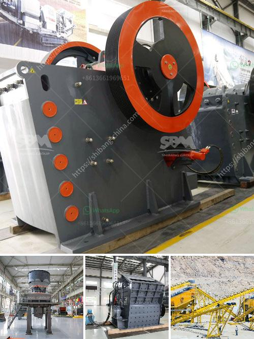

<h3>mobile crusher plant south africa</h3>
South Africa is a country with rich mineral resources and it is one of the leading countries in the production of metals and minerals. In recent years, mobile crushing plant has become increasingly popular in the mining industry. Mobile crushing plants have a small footprint and provide great crushing capability with excellent mobility. The mobile crusher plant also called portable crushing plant is a flexible and powerful crushing solution designed for small to medium projects. It provides on-sites crushing without material transporting from one place to another, thus reducing your material transportation costs. The output capacity ranges from 100t/h to 400t/h.

Mobile crusher plant in south africa has the advantage of reasonable match, unobstructed material discharge, reliable run, convenient operation, high efficiency and energy conservation. The good mobility can make it move in and between different quarries. It can also work with other plants to meet different requirements of customers.

Mobile crusher plant for sale South Africa has the characteristics of high productivity, innovative design and superior performance. It has a compact design and can be installed in a short time. Furthermore, it provides a low initial investment cost for customers in the quarrying industry.

Combine the crushing, grinding,dring, classifier and elevator, the system of vertical mill is simple and occupation area is about 50% of ball mill system. It can be installed outside, so it will reduce a large number of investment cost;

Less wear and tear: The optimized roller and the high quality raw material make the machine’s life more longer;

High dring ability. As the hot air inside contacts directly with the material, drying ability is higher, and it saves energy. By regulating the air temperature, it can meet requirements with different humidity;

Low investment cost, simple process, less equipment, low layout, small capacity and few floor. This saves the cost of investment.

Hitachi mobile crusher plant is a good choice for Iron Ore Processing in South Africa. In the process of gravel crushing, mobile crusher mainly used for the processing of mineral ores that are needed for processing every project can provide mobile jaw crusher, mobile impact crusher, mobile sand making machine, mobile screening equipment and other models to meet the needs of various industries and fields. With high flexibility and reliable performance, it can be used for the crushing of a variety of ores, rocks, and construction waste.

In conclusion, it is suitable for industries with high environmental requirements, strong site operation capability, and small area occupation. It provides customers with efficient and low-cost operation plans. The mobile crushing and screening plant has a variety of configurations that can be customized according to needs and can efficiently move and produce.

In conclusion, mobile crusher plant is a flexible and powerful crushing solution designed for small to medium projects. It provides on-site crushing without material transporting from one place to another, thus reducing your material transportation costs. The output capacity ranges from 100t/h to 400t/h, and it is widely used in the quarrying industry, mining industry, construction waste recycling, and industrial minerals processing. Whether you are looking to crush tonnes of hard rock or produce several sized aggregates, mobile crusher plant can be the ideal choice.
<h3>Contact us</h3><ul><li><strong>Whatsapp:&nbsp;<a href="https://wa.me/8613661969651">+8613661969651</a></strong></li><li><a href="https://swt.shibang-china.com/?git&amp;zhl&amp;mobile crusher plant south africa"><strong>Online Service(chat now)</strong></a></li></ul><h3>Related</h3><ul><li><a href='telcum powder plant manufacturer.md'>telcum powder plant manufacturer</a></li><li><a href='used industrial dryer for sale in india.md'>used industrial dryer for sale in india</a></li><li><a href='grinding mill for bentonite.md'>grinding mill for bentonite</a></li><li><a href='cement grinding units in india basalt crusher quotes.md'>cement grinding units in india basalt crusher quotes</a></li><li><a href='quarry crusher machine price.md'>quarry crusher machine price</a></li></ul>