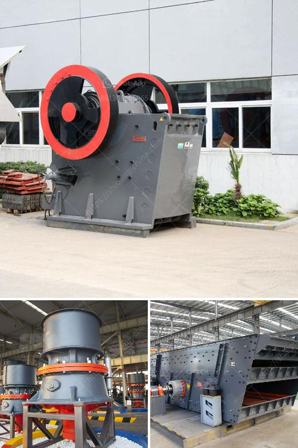

<h3>mobile crusher rates per hour</h3>
The usage of mobile crushers is advantageous for multiple reasons. Firstly, it allows for on-site crushing, eliminating the need to transport materials to a centralized location for crushing. This not only saves time but also reduces transportation costs, making mobile crushers a cost-effective solution. However, one crucial factor to consider when opting for mobile crushers is their rate per hour. Understanding these rates and how they can impact projects is essential.

Mobile crusher rates per hour vary depending on several factors. The type, size, and efficiency of the unit play a significant role in determining its hourly rate. Different models may have different capabilities and produce varying outputs. Additionally, the geographic region and market competition can also influence rates.

Typically, mobile crushers can operate at varying rates per hour, ranging from 50 to 500 tons per hour. The higher the capacity, the higher the hourly rate would be. This rate may also fluctuate based on the material being crushed. For instance, crushing softer materials may yield a higher output rate as compared to denser and harder materials.

Mobile crushers have revolutionized the construction industry by providing an efficient and versatile solution for on-site crushing. They are widely used in various applications such as quarrying, construction waste recycling, and mining operations. These machines can crush different types of materials, including concrete, brick, asphalt, and natural stone.

The hourly rate for mobile crushers can significantly impact project budgets and timelines. Contractors and businesses need to carefully analyze and compare the rates offered by different service providers before selecting the most suitable option. It is advisable to request detailed quotes specifying the hourly rates and any additional costs.

In addition to the hourly rate, it is essential to consider other factors when choosing a mobile crusher. Reliability, maintenance requirements, fuel consumption, and environmental impact are all aspects that need to be taken into account. Mobile crushers with lower fuel consumption can help reduce operating costs in the long run.

Moreover, it is essential to look beyond the hourly rate and consider the overall efficiency and productivity of the mobile crusher. A high hourly rate may be justifiable if the crusher offers superior performance, produces high-quality end products, and requires minimal downtime for maintenance or repairs.

In conclusion, mobile crusher rates per hour can vary depending on several factors such as the type, size, and efficiency of the unit, as well as the geographic region and market competition. Contractors and businesses must carefully evaluate these rates and consider other factors, such as reliability, maintenance requirements, and environmental impact, before selecting a mobile crusher. While the hourly rate is crucial, it should not be the sole determining factor. By conducting thorough research and analyzing all relevant aspects, finding the most cost-effective and efficient mobile crusher becomes possible.
<h3>Contact us</h3><ul><li><strong>Whatsapp:&nbsp;<a href="https://wa.me/8613661969651">+8613661969651</a></strong></li><li><a href="https://swt.shibang-china.com/?git&amp;zhl&amp;mobile crusher rates per hour"><strong>Online Service(chat now)</strong></a></li></ul><h3>Related</h3><ul><li><a href='crusher machine for mineral powder.md'>crusher machine for mineral powder</a></li><li><a href='limestone rock crushing.md'>limestone rock crushing</a></li><li><a href='mobile crusher india.md'>mobile crusher india</a></li><li><a href='approach to the problem of a mineral crusher.md'>approach to the problem of a mineral crusher</a></li><li><a href='sand core machine manufacturers.md'>sand core machine manufacturers</a></li></ul>