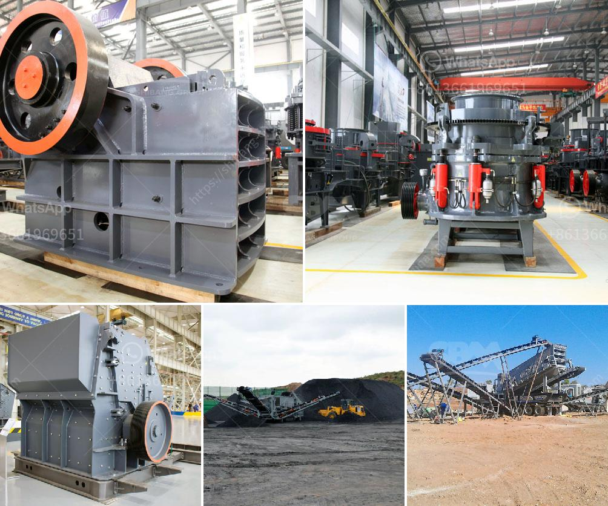

<h3>mobile crusher rental indonesia</h3>
Mobile crushing plant incorporates all the equipment and puts them on one truck, so it has high chassis and narrower body comparatively, which ensures that the mobile crushing plant can easily transport on highways and move to crushing sites on a regular basis. Mobile crusher is an essential machine used in the crushing process of recycling construction waste. It can realize construction waste disposal, converting it into renewable resources. The mobile crusher can not only solve the historical problem left by the rapid development of cities such as construction waste, but also further promote the green development of cities. Therefore, it is quite popular among investors and users in the current market.

Mobile crusher rental Indonesia has a wide range of applications to fit various crushing and screening projects. The mobile crusher is also equipped with a hydraulic drive system, which makes it easy to move and maintain. The most advanced models of mobile crusher rental Indonesia are equipped with intelligent technology and centralized control systems. This technology guarantees a high level of automation and excellent interlocking characteristics, which simplifies the installation and commissioning process of the entire system.

The mobile crusher rental Indonesia consists of the primary crushing equipment, secondary crushing equipment, and tertiary crushing equipment. The crushers range in size from 0.6 meters to 1.5 meters. The mechanical screening equipment is incorporated into the complete mobile crushing plant, which reflects the advanced technology and creativity of SBM's product design. This mobile crusher rental Indonesia ensures the crushing process is completed with high efficiency and low energy consumption so it saves you sizeable amount of money.

The mobile crushing plant has a strong processing capability and can efficiently process construction waste into reusable concrete, transformed into environmentally friendly building materials and aggregated for roadbed stone, reducing the environmental pollution caused by improper disposal. The utilization value of the construction waste can reach 80-100% according to different scenarios.

SBM mobile crusher rental Indonesia has a special structure, advanced technology and excellent quality. It meets the requirements of national environmental protection standards, and has low noise, small dust, and reliable performance. It is the ideal processing equipment for construction waste transformation.

The mobile crusher rental Indonesia provides assurance and reliable service to the customers. We have complete after-sales service, including installation, commissioning, training, and operator guidance. Most of our engineers are equipped with more than 10 years of experience in crushing and screening projects. The mobile crushing equipment produced by our company is not only favored by Indonesians, but also by customers from other countries.

The latest addition to our Mobile Crushing and Screening plant is the Sandvik QJ341 jaw crusher. This compact and mobile track-mounted crusher includes many new features, making it user-friendly and environmentally focused, reducing downtime and maximizing the return on investment. It has its own remote control movement and operation, and can be used to crush a variety of materials, including aggregates, concrete, asphalt, and brick.

In conclusion, mobile crusher rental Indonesia has a wide range of applications to meet the needs of various users, and it guarantees a high level of automation and excellent interlocking characteristics. This equipment produces materials with high output and good product shape. It is also convenient and efficient to operate, and its stable performance and easy maintenance make it popular among customers.
<h3>Contact us</h3><ul><li><strong>Whatsapp:&nbsp;<a href="https://wa.me/8613661969651">+8613661969651</a></strong></li><li><a href="https://swt.shibang-china.com/?git&amp;zhl&amp;mobile crusher rental indonesia"><strong>Online Service(chat now)</strong></a></li></ul><h3>Related</h3><ul><li><a href='quartz mining process.md'>quartz mining process</a></li><li><a href='conveyor belts china.md'>conveyor belts china</a></li><li><a href='sand sieve machine.md'>sand sieve machine</a></li><li><a href='malaysia stone crushing machine crusher for sale.md'>malaysia stone crushing machine crusher for sale</a></li><li><a href='ball mill hammer mill roller mill machine.md'>ball mill hammer mill roller mill machine</a></li></ul>