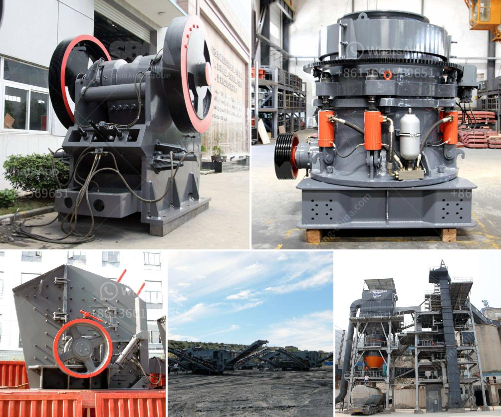

<h3>mobile crusher sales in nairobi</h3>
In recent years, Nairobi, the capital city of Kenya, has experienced a surge in infrastructure development. The construction industry has been thriving, and this has created an ever-increasing demand for building materials. One key material that has become instrumental in the construction process is crushed stones, and to meet this demand, mobile crushers have become crucial.

A mobile crusher is a machine designed to reduce large rocks into smaller rocks, gravel, or rock dust. This machinery can easily and efficiently handle different types of raw materials, whether it be granite, limestone, or iron ore. With its portable nature, mobile crushers can be easily transported from one site to another, making them an ideal choice for construction activities in and around Nairobi.

The demand for mobile crushers in Nairobi has been steadily increasing due to several factors. Firstly, the government's ambitious infrastructure development plans have fueled the need for crushed stones for road construction, housing projects, and commercial buildings. Nairobi is witnessing a rapid urbanization trend, and this has resulted in an increased demand for housing and commercial spaces. Mobile crushers play a vital role in providing the necessary raw materials for these constructions.

Secondly, mobile crushers offer significant cost savings compared to traditional crushers. Traditional crushers require a dedicated space and infrastructure to operate, whereas mobile crushers are compact and can be easily set up on-site, eliminating the need for additional transportation costs. Moreover, mobile crushers can process the raw materials directly on-site, reducing the need for transporting them to a central processing facility and resulting in substantial savings in time and fuel costs.

Another factor contributing to the rise of mobile crusher sales in Nairobi is the growing emphasis on environmental sustainability. Mobile crushers are equipped with advanced technologies that minimize dust emissions and noise pollution. This makes them more environmentally friendly compared to traditional crushers, which generate significant amounts of dust and noise, causing inconvenience and health hazards to nearby residents.

The market for mobile crushers in Nairobi is highly competitive. Several reputed international and domestic manufacturers have tapped into this emerging market, offering a wide range of mobile crusher models catering to different requirements. These machines come with various features and capabilities to meet the diverse needs of construction projects in Nairobi.

To stay ahead in this competitive market, manufacturers are continuously investing in research and development to improve the efficiency and performance of their mobile crushers. They are incorporating advanced technologies, such as remote monitoring, automatic control systems, and energy-saving features, to enhance the overall user experience and maximize productivity.

In conclusion, mobile crusher sales in Nairobi are witnessing a significant upsurge, driven by the booming construction industry, cost savings, and environmental considerations. These machines have become an indispensable asset to construction companies in Nairobi, providing them with a reliable and efficient solution for crushing raw materials on-site. As the city continues to grow and develop, the demand for mobile crushers is expected to rise, presenting manufacturers with tremendous opportunities for expansion and innovation.
<h3>Contact us</h3><ul><li><strong>Whatsapp:&nbsp;<a href="https://wa.me/8613661969651">+8613661969651</a></strong></li><li><a href="https://swt.shibang-china.com/?git&amp;zhl&amp;mobile crusher sales in nairobi"><strong>Online Service(chat now)</strong></a></li></ul><h3>Related</h3><ul><li><a href='study of a fero chrome crushing plant.md'>study of a fero chrome crushing plant</a></li><li><a href='iron ore pellet making process.md'>iron ore pellet making process</a></li><li><a href='model project of soap stone powder.md'>model project of soap stone powder</a></li><li><a href='marble grinder mill machine price in pakistan.md'>marble grinder mill machine price in pakistan</a></li><li><a href='double roller stone cracher.md'>double roller stone cracher</a></li></ul>