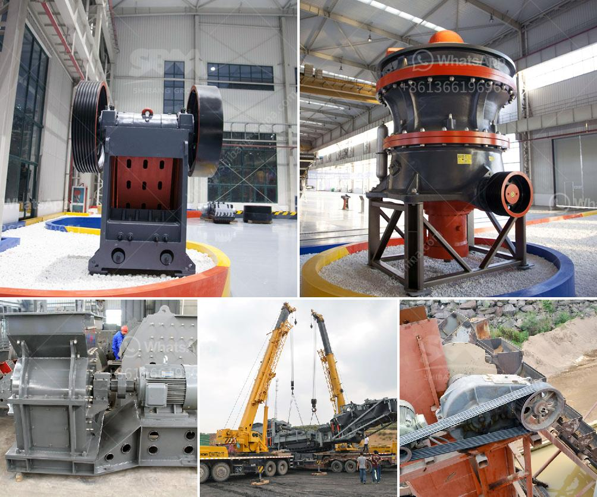

<h3>mobile crushers for hire in gauteng south africa</h3>
Nowadays, mobile crushers for hire in Gauteng South Africa are becoming increasingly popular. The demand for these machines is constantly increasing, as contractors and other companies seek versatile and efficient solutions to their construction and demolition tasks. In response to this, various companies in the region are now offering mobile crushers for hire to meet the growing demand.

One of the main advantages of hiring mobile crushers is their flexibility. It allows contractors to choose the crushing equipment that suits the specific requirements of their project, and to move the machine to the site as needed. Whether it is a small construction site or a large demolition project, mobile crushers can be easily transported to and from the site, which helps to save both time and money.

Another benefit of using mobile crushers is that they offer excellent productivity levels. These machines are designed to be highly efficient, allowing operators to process large amounts of material quickly and effectively. This is particularly beneficial for projects that require the crushing of large quantities of concrete, rubble, or other materials. The ability to process materials on-site also minimizes the need for transportation, further enhancing productivity and reducing costs.

In addition to their flexibility and productivity, mobile crushers for hire in Gauteng South Africa are also environmentally friendly. These machines are designed to minimize noise and dust emissions, making them suitable for use in urban areas. They are equipped with advanced technology that helps to reduce pollution and minimize the impact on the surrounding environment. This is particularly important in densely populated areas, where the impact of construction and demolition activities on air quality can be significant.

When hiring mobile crushers in Gauteng South Africa, it is important to consider a few key factors. First and foremost, it is essential to choose a reputable company that has extensive experience in the industry. This ensures that the equipment provided is of high quality and that the necessary support and maintenance services are available. Additionally, it is important to consider the specific requirements of the project and to choose the right type and size of mobile crusher for the job. Consulting with experts in the field can help select the best machine for the desired application.

In conclusion, mobile crushers for hire in Gauteng South Africa offer a range of benefits and flexibility to contractors and other companies in the construction and demolition industry. These machines are efficient, versatile, and environmentally friendly, making them an attractive option for various projects. With the growing demand for mobile crushers, it is crucial to select a reliable provider and to choose the right equipment for the job at hand. By doing so, contractors can ensure efficient crushing operations that meet their specific requirements.
<h3>Contact us</h3><ul><li><strong>Whatsapp:&nbsp;<a href="https://wa.me/8613661969651">+8613661969651</a></strong></li><li><a href="https://swt.shibang-china.com/?git&amp;zhl&amp;mobile crushers for hire in gauteng south africa"><strong>Online Service(chat now)</strong></a></li></ul><h3>Related</h3><ul><li><a href='rent a portable conveyor belt system malaysia.md'>rent a portable conveyor belt system malaysia</a></li><li><a href='stone crusher machine in malaysia.md'>stone crusher machine in malaysia</a></li><li><a href='vibrating feeder screen.md'>vibrating feeder screen</a></li><li><a href='sand dryer machines suppliers south africa.md'>sand dryer machines suppliers south africa</a></li><li><a href='limestone ball milling.md'>limestone ball milling</a></li></ul>