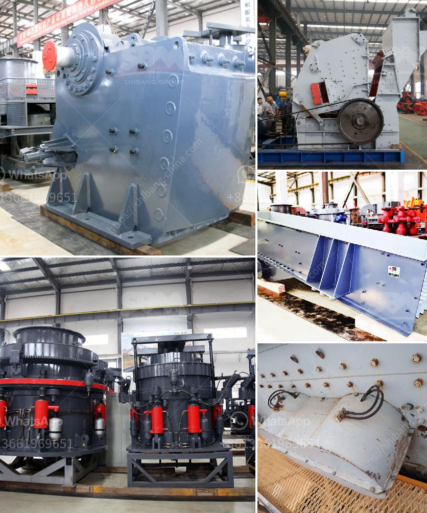

<h3>mobile crushers ghana</h3>
Mobile crushers have become an essential equipment in the mining and construction industry. These machines help improve productivity, reduce labor costs, and have a positive impact on the environment. The rapid growth of Ghana’s economy has led to an increase in construction projects, making mobile crushers a lucrative investment for businesses in the country.

One of the primary benefits of mobile crushers is their versatility. These machines can be used for a wide range of applications, such as crushing rocks, concrete, and asphalt. This versatility allows contractors to efficiently complete various projects, whether it’s building roads, bridges, or even residential or commercial structures. With a mobile crusher, businesses can easily process materials at the construction site, eliminating the need for transportation and reducing costs.

Another advantage of mobile crushers is their efficiency in reducing material size. These machines use a powerful jaw or impact crusher mechanism to crush materials into smaller pieces. By reducing the size of materials, mobile crushers make it easier to transport and dispose of waste materials. This not only saves time but also contributes to a cleaner and greener environment. Additionally, smaller pieces of materials are easier to handle and can be recycled or reused for other construction projects.

Ghana’s mining industry also benefits from the use of mobile crushers. The country is rich in various mineral resources, such as gold, diamond, bauxite, manganese, and iron ore. With the growing demand for these resources, mobile crushers play a crucial role in extracting and processing these minerals. They are used to crush large rocks and stones into smaller pieces, which are then further processed for various purposes.

Furthermore, mobile crushers offer significant cost savings for mining and construction companies in Ghana. Traditional crushers require a significant amount of labor and resources to operate. However, with mobile crushers, companies can reduce labor costs as fewer workers are required to operate the machines. Additionally, mobile crushers are fuel-efficient, which helps reduce fuel costs. These cost savings contribute to increased profitability for businesses operating in the mining and construction industry.

It is important to note that mobile crushers require regular maintenance to ensure their optimal performance. Regular inspections, lubrication, and replacing worn-out parts are essential to prolong the lifespan of these machines. Additionally, operators should be properly trained to operate mobile crushers safely and efficiently.

In conclusion, mobile crushers have become an indispensable equipment for Ghana’s mining and construction industry. Their versatility, efficiency, and cost-effectiveness make them a valuable asset for businesses operating in this sector. As the demand for mineral resources and construction projects continues to grow in Ghana, investing in mobile crushers can provide significant benefits for companies, helping them to meet the country’s infrastructure needs while maximizing profitability.
<h3>Contact us</h3><ul><li><strong>Whatsapp:&nbsp;<a href="https://wa.me/8613661969651">+8613661969651</a></strong></li><li><a href="https://swt.shibang-china.com/?git&amp;zhl&amp;mobile crushers ghana"><strong>Online Service(chat now)</strong></a></li></ul><h3>Related</h3><ul><li><a href='kaolin process flow diagram.md'>kaolin process flow diagram</a></li><li><a href='mobile crusher machine.md'>mobile crusher machine</a></li><li><a href='stone crusher mobile crusher layout.md'>stone crusher mobile crusher layout</a></li><li><a href='raymond mill micro pulverizer.md'>raymond mill micro pulverizer</a></li><li><a href='usa used equipment grinding mill minerals 3 tph 200 mesh.md'>usa used equipment grinding mill minerals 3 tph 200 mesh</a></li></ul>