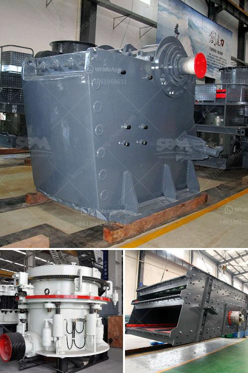

<h3>mobile crushing and screening contractors south africa</h3>
Mobile crushing and screening contractors are increasingly in demand in the construction and mining industries. The advent of mobile equipment means that stone quarries and other mining sites can crush and screen material right where it is needed, reducing the need for transportation and saving on costs.

In South Africa, such contractors operate on different scales. Some operate on a smaller scale and are capable of crushing and screening a few thousand tons of material per month, while others operate on a larger scale and can handle crushing and screening of hundreds of thousands of tons per month.

One of the key benefits of using mobile crushing and screening contractors is their flexibility. They can be easily transported to different sites, enabling a quick and efficient setup wherever it is required. This is especially useful in remote areas where transportation and access to materials may be challenging. It also allows for increased productivity and reduced downtime as the contractors can quickly move from one site to another.

Another advantage of mobile crushing and screening contractors is their ability to process a wide range of materials. From limestone to asphalt, contractors can crush and screen various types of material to meet different project specifications. This versatility allows for cost-effective solutions as contractors can efficiently process materials on-site, eliminating the need for additional processing and transportation.

Moreover, mobile contractors are equipped with state-of-the-art equipment, including crushers, screens, and conveyors, which are designed to maximize productivity and minimize environmental impact. Advanced technology ensures efficient and precise crushing and screening, resulting in high-quality material that meets industry standards.

In terms of safety, mobile contractors prioritize the well-being of their workforce and work towards ensuring a safe working environment. They adhere to strict health and safety regulations to mitigate potential risks and hazards associated with mobile crushing and screening operations. Regular training and equipment maintenance are also implemented to ensure safe and reliable operations.

Mobile crushing and screening contractors also contribute to the local economy. By providing job opportunities for local communities, they promote economic growth and support small businesses. Additionally, contractors often source materials and equipment locally, further boosting the local economy.

In conclusion, the use of mobile crushing and screening contractors in South Africa offers numerous advantages. Their flexibility, ability to process a wide range of materials, advanced technology, and commitment to safety make them crucial players in the construction and mining industries. They not only provide cost-effective solutions but also contribute to the local economy, making them an integral part of the South African market.
<h3>Contact us</h3><ul><li><strong>Whatsapp:&nbsp;<a href="https://wa.me/8613661969651">+8613661969651</a></strong></li><li><a href="https://swt.shibang-china.com/?git&amp;zhl&amp;mobile crushing and screening contractors south africa"><strong>Online Service(chat now)</strong></a></li></ul><h3>Related</h3><ul><li><a href='how to extract gold from river sand.md'>how to extract gold from river sand</a></li><li><a href='types of ball mill machine for gold.md'>types of ball mill machine for gold</a></li><li><a href='gold wash plants for sale in south africa.md'>gold wash plants for sale in south africa</a></li><li><a href='american stone crusher price.md'>american stone crusher price</a></li><li><a href='continous ball mill with cyclone suppliers in india.md'>continous ball mill with cyclone suppliers in india</a></li></ul>