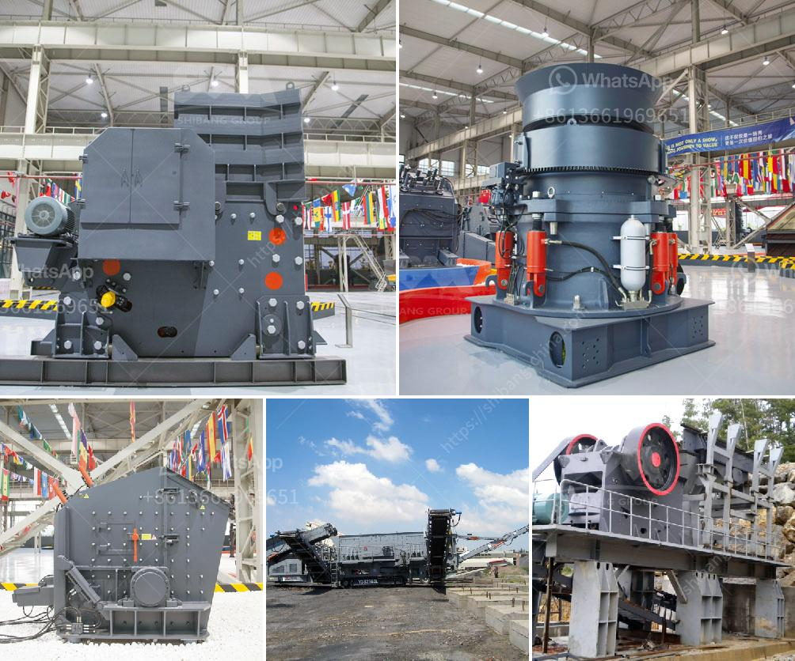

<h3>mobile crushing and screening</h3>
Mobile crushing and screening plants have gained immense popularity in recent years, thanks to their flexibility and efficiency. These machines are capable of reducing the size of rocks and stones into smaller, more manageable sizes, allowing for easier transportation and disposal. Transforming materials on-site has become increasingly valuable for various industries, such as construction, mining, and recycling.

One of the primary benefits of mobile crushing and screening plants is their mobility. Unlike traditional stationary crushers, mobile crushers can be easily transported between different job sites. This mobility allows operators to crush and screen materials directly at the location where they are needed. No longer do materials need to be transported to a fixed crusher and then transported back to the job site once they are crushed. This saves significant time and money, as well as reduces the carbon footprint associated with transportation.

The efficiency of mobile crushing and screening plants is also impressive. The machines are designed to process large volumes of material in a relatively short amount of time. The incorporation of advanced technology ensures that productivity is maximized, while maintaining high levels of quality. Additionally, these machines are equipped with screening units that allow for precise separation of different-sized materials. This is particularly advantageous for construction projects, where specific material sizes are required for different aspects of the project.

Another significant advantage of mobile crushing and screening plants is their ability to process various types of materials. These machines can handle rocks, stones, ores, coal, and even concrete rubble. The versatility of mobile crushers allows operators to crush materials of different hardness levels, whether it be soft limestone or hard granite. This adaptability is advantageous for industries that require processing of different types of materials for various applications.

Mobile crushing and screening plants are not only beneficial for various industries, but they also contribute to environmental sustainability. By crushing materials on-site, the need for transporting materials and disposing of them off-site is significantly reduced. This ultimately cuts down on carbon emissions and environmental pollution associated with transportation. Additionally, the ability to recycle materials, such as concrete rubble, reduces the demand for new raw materials, further promoting sustainability.

In conclusion, mobile crushing and screening plants have revolutionized the way materials are processed and managed. The mobility, efficiency, versatility, and environmental benefits these machines offer have made them an essential tool for various industries. Whether it is for construction projects, mining operations, or recycling initiatives, mobile crushers and screens have proven to be a valuable asset. As technology continues to advance, these machines will only become more efficient, further improving productivity and sustainability in the future.
<h3>Contact us</h3><ul><li><strong>Whatsapp:&nbsp;<a href="https://wa.me/8613661969651">+8613661969651</a></strong></li><li><a href="https://swt.shibang-china.com/?git&amp;zhl&amp;mobile crushing and screening"><strong>Online Service(chat now)</strong></a></li></ul><h3>Related</h3><ul><li><a href='sale limestone crusher malaysia.md'>sale limestone crusher malaysia</a></li><li><a href='quartz stone crushing milling.md'>quartz stone crushing milling</a></li><li><a href='industrial application of pebble mill.md'>industrial application of pebble mill</a></li><li><a href='price of mobile stone crusher 100 200 tph.md'>price of mobile stone crusher 100 200 tph</a></li><li><a href='ball mill cost for 100ton cement plant.md'>ball mill cost for 100ton cement plant</a></li></ul>