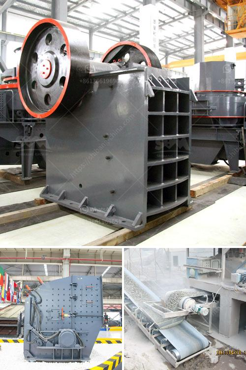

<h3>mobile crushing machine sales in south africa</h3>
The advent of mobile crushing plant has brought great convenience to our life. It has a wide range of applications in various industries. Mobile crushing machines have entered the South African market and have a bright future.

At present, South Africa has very few high-quality ore crushing machines. With the gradual increase in the demand for materials such as iron ore and bauxite in the country, the South African market has further expanded. The sales of mobile crushing machines are accelerating.

If you want to buy a mobile crushing machine, quality is an important factor that cannot be ignored. Get reviews from other customers who have used the equipment in order to get a real understanding of its efficiency and durability. Quality equipment will save you money in the long run, even though the initial cost may be higher.

The mobile crushing machine may be a boon or a disaster. It is important to be cautious when purchasing mobile crushing machines in order to avoid unnecessary troubles. Be it quality or after-sales service, you need to know the certain factors which can affect the machine before purchasing.

In terms of price, the cost of mobile crushing machines is always a major issue that users are most concerned about. After all, when investing in a mobile crusher, it is necessary to see how much the machine is worth. The price directly affects the economic benefits of users. As a direct-sales manufacturer, Fote Machinery has always been committed to providing users with affordable equipment, so that they can buy the most cost-effective mobile crushing machines with high quality and affordable prices.

In addition to quality and price, service is also an important consideration in purchasing mobile crushing machines. Reliable after-sales service can effectively guarantee the operation continuity and efficiency of the equipment after purchase. When users encounter problems during use, a professional and timely after-sales team can quickly respond to and solve the problem. This greatly reduces the user's downtime and maintenance costs.

In summary, the sales of mobile crushing machines in South Africa are increasing, and the prospects for future development are bright. The choice of a high-quality mobile crusher is equal to choosing a high-quality service provider. It is equally important to choose a suitable equipment manufacturer, which directly affects the economic benefits of users. Users need to pay attention to the factors such as quality, price, and service before purchasing. Fote Machinery is a good choice. It is a professional manufacturer of mobile crushing machines with high-quality equipment, affordable prices, and excellent after-sales service.
<h3>Contact us</h3><ul><li><strong>Whatsapp:&nbsp;<a href="https://wa.me/8613661969651">+8613661969651</a></strong></li><li><a href="https://swt.shibang-china.com/?git&amp;zhl&amp;mobile crushing machine sales in south africa"><strong>Online Service(chat now)</strong></a></li></ul><h3>Related</h3><ul><li><a href='grinding mill machine price in chennai.md'>grinding mill machine price in chennai</a></li><li><a href='ball mill liners manufacturers.md'>ball mill liners manufacturers</a></li><li><a href='small coal mining machine.md'>small coal mining machine</a></li><li><a href='machines for stone crushing from poland.md'>machines for stone crushing from poland</a></li><li><a href='ball mill manufacturers china.md'>ball mill manufacturers china</a></li></ul>