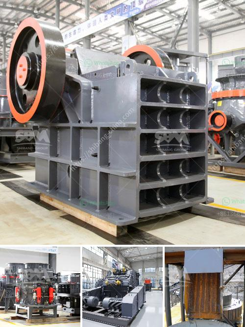

<h3>mobile crushing plant for sale</h3>
In the construction and mining industries, there is a constant need for gravel, sand, and other aggregate materials. Crushing plants that utilize a mobile crushing plant can easily be transported between sites, allowing for quick and efficient crushing operations. The machine can be responsibly recycled and reused, which significantly reduces the environmental impact.

A mobile crushing plant refers to a set of crushing equipment that is mounted on wheels. This type of crushing equipment allows manufacturers to take advantage of efficient operation while reducing transportation costs. With portable crushing plants, productivity can get boosted by up to 50% compared to conventional stationary crushers.

One of the main advantages of a mobile crushing plant is its flexibility. Since the entire machine is mounted on wheels, it can easily be moved from one location to another. This makes it an ideal solution for construction and mining companies that frequently move between job sites. Instead of relying on costly transportation services, they can simply drive the crushing plant to the necessary area.

Moreover, a mobile crushing plant allows for quick set-up and dismantling, reducing the down time between projects. This ensures that projects are completed on schedule, maximizing productivity. Contractors can continuously move the crushing plant to new locations, tackling different projects without interruption. With a crushing capacity of up to 650 tons per hour, mobile crushing plants are suitable for even the most demanding crushing tasks.

Another advantage of a mobile crushing plant is its lower environmental impact. When a crushing plant is set up on a construction or mining site, the materials needed to fuel the plant have to be transported from far away. This process generates significant carbon emissions and increases pollution levels. Conversely, a mobile crushing plant can be powered by onsite fuel sources, reducing the need for transportation and minimizing greenhouse gas emissions. Furthermore, the mobile crushing plant does not disturb local communities with noise and dust pollution.

For companies in the construction and mining industries, investing in a mobile crushing plant can offer significant benefits. By reducing transportation costs and improving productivity, they can increase their profits. Additionally, the environmentally friendly nature of mobile crushing plants ensures compliance with sustainability goals and regulations. This can enhance a company's reputation and attract environmentally conscious clients.

When it comes to purchasing a mobile crushing plant for sale, there are several factors to consider. First, companies should evaluate the production needs and expected demand for the plant. This will determine the necessary crushing capacity. Additionally, it is essential to choose a reliable manufacturer that offers high-quality equipment. Conducting thorough research and reading customer reviews can help identify reputable suppliers.

In conclusion, a mobile crushing plant is a must-have for the construction and mining industries. Its flexibility, quick set-up, and dismantling, as well as its lower environmental impact, make it a valuable addition to any operation. Investing in a mobile crushing plant for sale can greatly improve productivity, reduce costs, and contribute to a more sustainable future for the industry.
<h3>Contact us</h3><ul><li><strong>Whatsapp:&nbsp;<a href="https://wa.me/8613661969651">+8613661969651</a></strong></li><li><a href="https://swt.shibang-china.com/?git&amp;zhl&amp;mobile crushing plant for sale"><strong>Online Service(chat now)</strong></a></li></ul><h3>Related</h3><ul><li><a href='discharge chute for ball mill.md'>discharge chute for ball mill</a></li><li><a href='stone mining crusher in jharkhand.md'>stone mining crusher in jharkhand</a></li><li><a href='ball mill mesh output.md'>ball mill mesh output</a></li><li><a href='cost of concrete batch plant.md'>cost of concrete batch plant</a></li><li><a href='clay ball mill machine.md'>clay ball mill machine</a></li></ul>