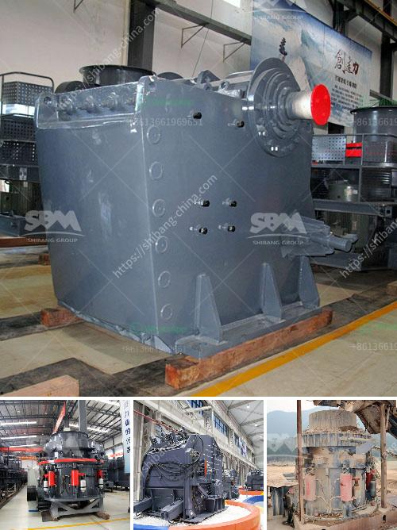

<h3>mobile crushing plant in peru</h3>
Peru is a country located in the west of South America. With a rich history and diverse culture, it is known for its ancient ruins such as Machu Picchu, as well as its vibrant cities like Lima.

In recent years, Peru has experienced a boom in its construction industry. This has led to an increased demand for building materials, including aggregates, which are the raw materials used in construction projects. To meet this demand, mobile crushing plants have become increasingly popular in Peru.

A mobile crushing plant is a unique machine that includes three stages of crushing. It has been around for many years, but the mobile crushing plant is finally reaching its peak in Peru, as many construction companies are focusing on improving efficiency and reducing costs.

In urban areas, where construction materials are often needed in small quantities and at short notice, a mobile crushing plant is the perfect solution. It can also be used in remote areas where there is limited access to traditional crushing machinery. This flexibility allows construction companies to adapt to different project requirements and ensures that the production of aggregates is not hindered.

One of the main advantages of a mobile crushing plant is its ability to move freely. This is achieved through multiple sets of wheels or tracks, which allow the machine to be transported to different locations. This is especially useful in Peru, where construction projects are often spread out over a large area. With a mobile crushing plant, companies are not limited to one fixed location and can easily move the machine to where it is needed.

Another important feature of a mobile crushing plant is its ease of set-up and operation. Unlike traditional crushing machinery, which requires a permanent foundation and a complex installation process, a mobile crushing plant can be set up and running in a matter of hours. This saves time and money, as construction companies do not need to wait for weeks or months to start crushing aggregates.

In addition to its mobility and ease of use, a mobile crushing plant has a high production capacity. With its three stages of crushing, it can process large quantities of materials quickly and efficiently. This is crucial in Peru, where construction projects are often on tight schedules and need a constant supply of aggregates.

The introduction of mobile crushing plants in Peru has had a positive impact on the construction industry. Not only has it improved efficiency and reduced costs, but it has also contributed to sustainable practices. By crushing and recycling materials on-site, less waste is generated, and the need for transportation of aggregates from distant quarries is minimized.

In conclusion, the mobile crushing plant has revolutionized the construction industry in Peru. Its mobility, ease of set-up and operation, and high production capacity make it an indispensable tool for construction companies. As Peru continues to experience growth in its construction sector, the demand for mobile crushing plants is expected to increase further, driving innovation and advancements in this field.
<h3>Contact us</h3><ul><li><strong>Whatsapp:&nbsp;<a href="https://wa.me/8613661969651">+8613661969651</a></strong></li><li><a href="https://swt.shibang-china.com/?git&amp;zhl&amp;mobile crushing plant in peru"><strong>Online Service(chat now)</strong></a></li></ul><h3>Related</h3><ul><li><a href='project report on m sand.md'>project report on m sand</a></li><li><a href='machinery required to extract the platinum.md'>machinery required to extract the platinum</a></li><li><a href='jaw crusher in germany used.md'>jaw crusher in germany used</a></li><li><a href='mobile quarry plant.md'>mobile quarry plant</a></li><li><a href='design of harmer mill.md'>design of harmer mill</a></li></ul>