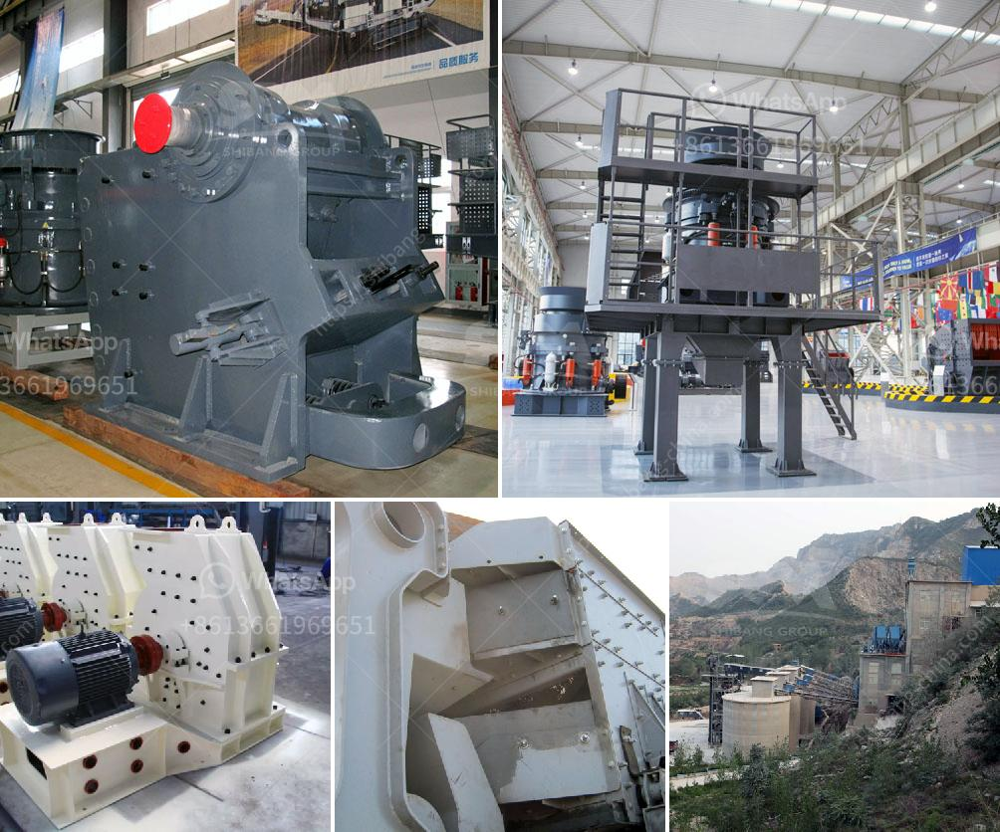

<h3>mobile crushing plant manufacturers</h3>
Mobile crushing plant manufacturers are facing increasing competition from other heavy machinery manufacturers, especially in the developing countries. Moreover, stringent governmental regulations are restraining the market growth to some extent. The emerging economies are witnessing rapid urbanization and this has resulted in the growth of the construction industry. Increasing construction activities in various countries will demand a good amount of crushing plants. Thus, mobile crushing plant manufacturers are in great demand. The market for mobile crushers and screeners is witnessing a steady rise across the world with the increase in the construction industry. Rapid urbanization, especially in developing countries, leading to enhanced infrastructure development, will drive the demand for mobile crushers and screeners. Additionally, the technological advancements in the mobile crushers and screeners will further help in the growth of the market.

One of the major factors driving the mobile crushing plant market is the advantages offered by the equipment in terms of its low operational costs. The rising prices of the crushing equipments all over the world proves to be a restraint to the growth of the global mobile crushing plant market. Global Mobile Crushing & Screening Plants market competition by top manufacturers/players, with Mobile Crushing & Screening Plants sales volume, Price (USD/Unit), revenue (Million USD) and Market Share for each manufacturer/player. The Top key players are Keestrack N.V., Eagle Crusher Company, Inc., McCloskey International, MEKA, Anaconda Equipment Ltd., Metso Corporation, Astec Industries, Inc., Kleemann GmbH, Terex Corporation, and SBM Mineral Processing GmbH among others. They cater to various applications across diverse industry verticals.

Efficiency and low operational costs are among the key factors driving mobile crushing plant manufacturers to migrate their business models from the traditional stationary crushing to mobile crushing. This transition from stationary to mobile crushers and screeners is expected to gain traction in the future, owing to the elimination of various costs associated with stationary equipment such as installation, transportation, and maintenance. These advantages reduce the time invested in plant dismantling as well as setting up the required infrastructure. The manufacturers aim at minimum emission level and also reduce the fuel consumption to increase cost savings. The machinery can be easily moved from one site to another, thus eliminating the need for installation of additional equipment and infrastructure in each site.

The mobile crushing plant manufacturers are also witnessing increasing demand from infrastructure industry, which includes construction of roads, railways, ports, bridges, etc. The demand for aggregates is expected to increase by considering the strict environmental rules. The government is focusing on bringing in technology to overcome challenges related to emissions, noise, and energy. The mobile crushing plant manufacturers are also taking initiatives to provide safer and more efficient machinery to their customers, which will help in reducing accidents and mitigating risks. Additionally, there is an increased focus on less noise and dust emissions in order to enhance the environmental impact of the mobile crushing plant.

In conclusion, the mobile crushing plant manufacturers are continuously investing in the research and development of technologically advanced products that can meet the growing market demand. Moreover, they are also focusing on expanding their production capabilities to strengthen their market position and cater to the changing customer preferences. The mobile crushing plant industry is experiencing great growth due to the competitive landscape and advancements in technology, which will continue to drive the market in the coming years.
<h3>Contact us</h3><ul><li><strong>Whatsapp:&nbsp;<a href="https://wa.me/8613661969651">+8613661969651</a></strong></li><li><a href="https://swt.shibang-china.com/?git&amp;zhl&amp;mobile crushing plant manufacturers"><strong>Online Service(chat now)</strong></a></li></ul><h3>Related</h3><ul><li><a href='vibrating screen consumption.md'>vibrating screen consumption</a></li><li><a href='cement export price in ethiopia.md'>cement export price in ethiopia</a></li><li><a href='difference between underground and open cast mining.md'>difference between underground and open cast mining</a></li><li><a href='industrial crusher machine.md'>industrial crusher machine</a></li><li><a href='portable impact crushers.md'>portable impact crushers</a></li></ul>