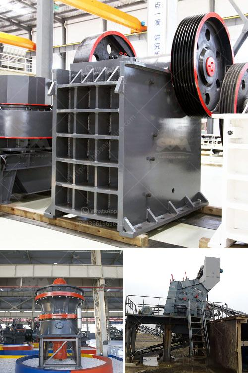

<h3>mobile jaw crusher for sale in pakistan</h3>
Mobile jaw crusher is used for crushing various materials in industries such as mining, building materials, road construction, and chemical industry, etc. It can crush materials on site or nearby, so the site can be put into use immediately. Mobile jaw crusher for sale in Pakistan is mainly composed of a feeding machine, jaw crusher, vibrating screen, conveyor belts, and other auxiliary equipment. With a wide range of applications, mobile jaw crusher is mainly used for primary crushing of various ores and bulk materials.

The mobile jaw crusher can crush materials of different sizes into a uniform particle size, can be adjusted by the adjusting device, reliable performance, and convenient maintenance. It has dense teeth on the surface of the crushing chamber, which can crush materials with high hardness effectively. The optimized crushing method makes the final product cubic-shaped and the granular size is adjustable, which is suitable for various construction projects.

The mobile jaw crusher for sale in Pakistan has a compact and lightweight structure, which greatly reduces the transportation cost and brings convenience to the users. Mobile jaw crusher for sale in Pakistan can work independently or together with other devices according to rough crushing or fine crushing requirements. Moreover, it has integrated complete unit equipment, which eliminates the cumbersome work of infrastructure installation and reduces labor consumption.

Mobile jaw crusher for sale in Pakistan has the advantages of simple structure, large crushing ratio, high production efficiency, uniform particle size of the finished product, easy maintenance and low operation cost. It can be widely used in many industries such as mining, smelting, building materials, highways, railways, water conservancy and chemical industries, etc.

In addition, the mobile jaw crusher for sale in Pakistan has the features of flexible movement, low noise, small dust, and environmentally friendly. It can be configured with various types of crushers, screens, and conveyors according to different production requirements to achieve different user needs. The user can choose different configurations according to the material types, sizes, and finished product requirements.

In conclusion, mobile jaw crusher for sale in Pakistan has large production capacity, compact structure, simple operation, reliable performance, convenient maintenance, and low operating cost. It is suitable for various materials and can meet different crushing requirements. With the continuous development of technology, there will be more and more types of mobile jaw crushers in the market, which will bring better benefits to users in terms of crushing efficiency and production capacity.
<h3>Contact us</h3><ul><li><strong>Whatsapp:&nbsp;<a href="https://wa.me/8613661969651">+8613661969651</a></strong></li><li><a href="https://swt.shibang-china.com/?git&amp;zhl&amp;mobile jaw crusher for sale in pakistan"><strong>Online Service(chat now)</strong></a></li></ul><h3>Related</h3><ul><li><a href='quartz mining process.md'>quartz mining process</a></li><li><a href='cost required for mini cement plant.md'>cost required for mini cement plant</a></li><li><a href='crushers for sale south africa.md'>crushers for sale south africa</a></li><li><a href='stone crushers in atlantico.md'>stone crushers in atlantico</a></li><li><a href='jaw and cone crusher.md'>jaw and cone crusher</a></li></ul>