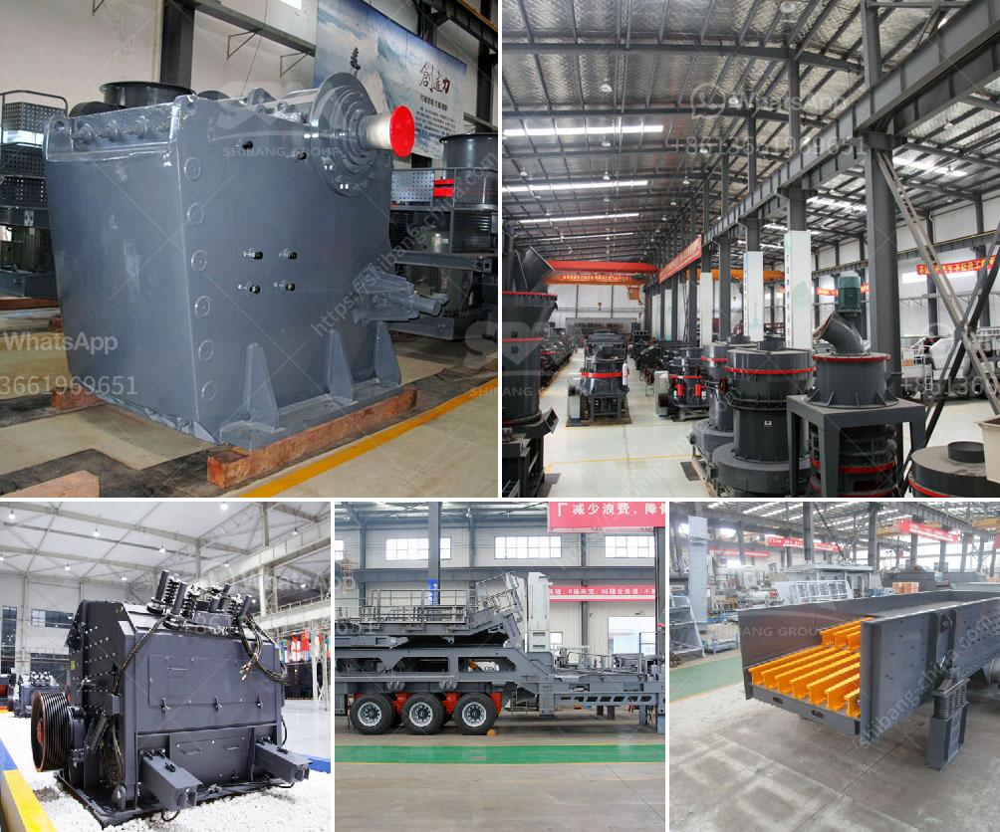

<h3>mobile jaw crushers for sale in italy</h3>
Mobile jaw crushers are widely used in the mining industry and can be found worldwide, primarily in Italy. As an innovative company, Komatsu is always striving to provide the best quality products and services to meet their customers' needs. Komatsu offers a wide range of mobile jaw crushers for sale in Italy, making it easy for customers to find the perfect one for their needs.

One of the advantages of mobile jaw crushers is the ability to move the unit easily, increasing flexibility in a job site. This feature allows contractors to save time and money as the unit can be transported to different locations quickly. It also allows for quicker set-up, reducing downtime and increasing productivity. The mobility factor makes these crushers a popular choice for contractors working on different projects and sites.

The Komatsu mobile jaw crushers for sale in Italy are equipped with a jaw crusher that applies compressive force to break down materials such as hard rock and concrete. This crusher is typically used for primary crushing of large rocks and other materials. It crushes the material in a crushing chamber between a fixed jaw and a moving jaw, exerting pressure on the material until it is broken down into smaller pieces.

Another advantage of mobile jaw crushers is their high capacity, which allows for processing large amounts of material efficiently. This is particularly beneficial for projects that require a significant amount of crushed material, such as road construction or mining operations. The high capacity of these crushers ensures that the material can be processed quickly, reducing the overall time required for the project.

Furthermore, the mobile jaw crushers offered by Komatsu in Italy are known for their durability and reliability. These crushers are built to withstand the toughest conditions in the mining industry. They are designed with strong and robust construction, ensuring that they can handle heavy-duty materials and continuous use. With proper maintenance and care, these crushers can last for many years, providing a reliable and efficient crushing solution.

In conclusion, mobile jaw crushers for sale in Italy are a practical and efficient choice for contractors in the mining industry. Komatsu offers a wide range of models to choose from, providing customers with options that can meet their specific needs. With their mobility, high capacity, and durability, these crushers are capable of crushing a wide range of materials, making them ideal for various applications. Contractors can rely on mobile jaw crushers to enhance their productivity and effectiveness on job sites.
<h3>Contact us</h3><ul><li><strong>Whatsapp:&nbsp;<a href="https://wa.me/8613661969651">+8613661969651</a></strong></li><li><a href="https://swt.shibang-china.com/?git&amp;zhl&amp;mobile jaw crushers for sale in italy"><strong>Online Service(chat now)</strong></a></li></ul><h3>Related</h3><ul><li><a href='gold sand processing technology.md'>gold sand processing technology</a></li><li><a href='ball and pebble mills.md'>ball and pebble mills</a></li><li><a href='mobile crusher on rent for iron ore.md'>mobile crusher on rent for iron ore</a></li><li><a href='dubai stone crushing auction.md'>dubai stone crushing auction</a></li><li><a href='hammer crusher buhler miag titan.md'>hammer crusher buhler miag titan</a></li></ul>