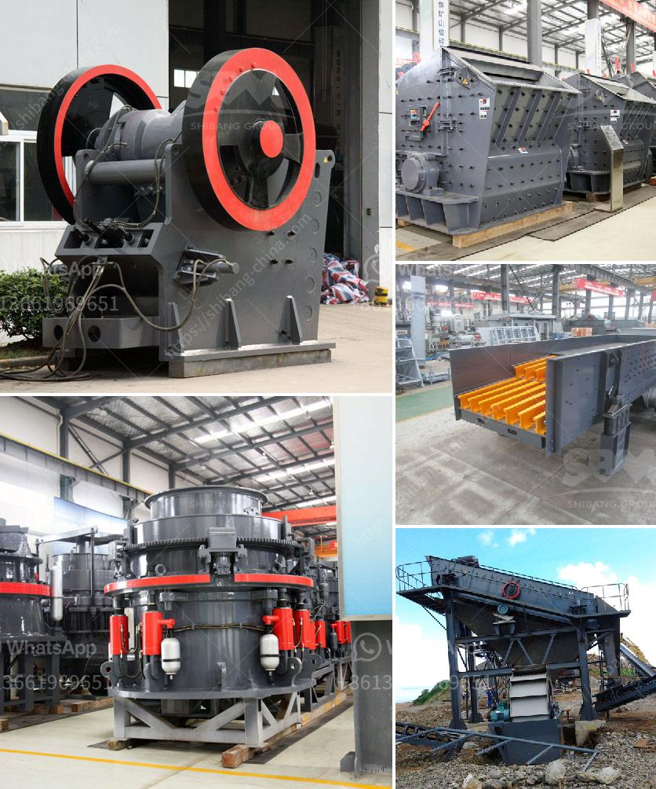

<h3>mobile jaw crushers</h3>
Mobile jaw crushers are an essential part of the crushing process due to their ability to crush all types of materials of any hardness level. Moblie jaw crushers of different models and sizes are suitable for different job sites, ensuring that you can find the ideal one for your needs. Whether it is for primary crushing or secondary crushing purposes, mobile jaw crushers offer flexibility and convenience.

One of the main advantages of mobile jaw crushers is their ability to be transported easily from one location to another. This makes them perfect for working in remote areas or on construction sites with limited access. Being able to move the crusher to the material rather than having to transport the material to the crusher saves time, energy, and money.

Another advantage of mobile jaw crushers is their compact design, which allows them to be easily maneuvered in tight spaces. Whether you are working in a confined construction site or a narrow quarry, a mobile jaw crusher can easily navigate through narrow passageways and tight corners. This enables efficient crushing even in challenging environments.

In addition to their mobility and compactness, mobile jaw crushers offer high performance and productivity. The powerful engines and efficient jaw crushers ensure that even the toughest materials can be processed quickly and effectively. The wide range of feed sizes that mobile jaw crushers can handle makes them suitable for various applications, from primary crushing of large rocks to secondary crushing of smaller materials.

Mobile jaw crushers are also known for their reliability and durability. These crushers are built to withstand the harsh conditions of construction sites and quarrying operations. From the robust construction of the frame to the high-quality components used in the crushers, mobile jaw crushers are designed to last and provide years of dependable service.

Furthermore, mobile jaw crushers can be equipped with additional features to enhance their functionality and efficiency. For example, some models can be equipped with a vibrating feeder or a pre-screening unit to remove fines before the material enters the crusher, reducing the risk of overloading and maximizing the crusher's performance. Other features may include hydraulic adjustment systems for easy and precise setting changes, automatic tramp release systems to prevent damage from uncrushable materials, and onboard or remote monitoring systems for real-time information on the crusher's performance.

Overall, mobile jaw crushers offer a range of benefits that make them an essential tool for any crushing operation. Their mobility, compactness, and high performance make them ideal for working in various environments and tackling different materials. Moreover, their reliability, durability, and additional features ensure that they can handle the demands of even the toughest crushing jobs. Whether you are in the construction industry, mining, or quarrying, mobile jaw crushers are a reliable and efficient solution for your crushing needs.
<h3>Contact us</h3><ul><li><strong>Whatsapp:&nbsp;<a href="https://wa.me/8613661969651">+8613661969651</a></strong></li><li><a href="https://swt.shibang-china.com/?git&amp;zhl&amp;mobile jaw crushers"><strong>Online Service(chat now)</strong></a></li></ul><h3>Related</h3><ul><li><a href='used hammer mill for sale in south africa.md'>used hammer mill for sale in south africa</a></li><li><a href='tracked crushers for sale south africa.md'>tracked crushers for sale south africa</a></li><li><a href='silica sand mill.md'>silica sand mill</a></li><li><a href='movable stone crusher.md'>movable stone crusher</a></li><li><a href='ball mill mesh output.md'>ball mill mesh output</a></li></ul>