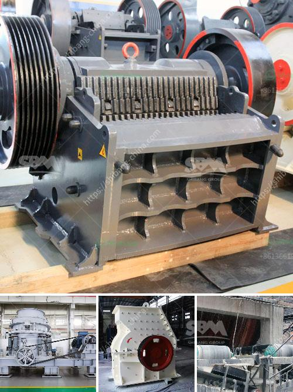

<h3>mobile mining processing plant services</h3>
Mining plays a vital role in the extraction and processing of minerals that are essential for various industrial applications. From precious metals like gold and silver to industrial metals like copper and iron, mining operations are crucial for meeting the growing demand for these resources. However, the process of mining and processing minerals can be complex and requires sophisticated equipment and expertise. This is where mobile mining processing plant services come into play, providing efficient solutions for companies involved in the mining industry.

Mobile mining processing plant services offer a flexible and cost-effective approach to mineral extraction and processing. Unlike traditional stationary processing plants, mobile plants are designed to be easily transported to mining sites, allowing for convenient on-site processing. This eliminates the need for expensive transportation of raw materials to distant processing facilities, reducing overall costs and improving operational efficiency. 

One of the key advantages of mobile mining processing plants is their ability to adapt to varying mining conditions. With advanced technology and equipment, these plants can be customized to handle different types of minerals and accommodate specific processing requirements. Whether it is crushing, grinding, screening, or other processing operations, mobile plants can be equipped with the necessary machinery and systems to ensure optimal performance.

In addition to flexibility, mobile mining processing plants also offer rapid deployment capabilities. Time is a critical factor in mining operations, and delays in setting up processing facilities can result in significant productivity losses. Mobile plants can be quickly assembled and put into operation, minimizing downtime and maximizing resource extraction. This enables mining companies to expedite the processing of minerals and meet tight production schedules.

Another advantage of mobile mining processing plants is their accessibility to remote and challenging mining sites. Many mineral deposits are located in remote or geographically challenging regions, making it difficult to establish permanent processing facilities. Mobile plants can be easily transported to these locations, overcoming logistical constraints and ensuring efficient mineral extraction. This opens up new possibilities for resource exploration and development in areas that were previously considered inaccessible.

Apart from their operational benefits, mobile mining processing plants also provide environmental advantages. These plants can be equipped with eco-friendly technologies and systems that minimize the impact on the environment. From dust control measures to water conservation practices, mobile plants are designed to comply with stringent environmental regulations and promote sustainable mining practices.

In conclusion, mobile mining processing plant services offer a range of advantages for companies engaged in mineral extraction and processing. With their flexibility, rapid deployment capabilities, and accessibility to remote sites, these plants ensure efficient and cost-effective operations. Moreover, they incorporate environmentally friendly features, aligning with the global push for sustainable mining practices. As the demand for minerals continues to rise, mobile mining processing plants play a critical role in meeting production needs while minimizing impact on the environment.
<h3>Contact us</h3><ul><li><strong>Whatsapp:&nbsp;<a href="https://wa.me/8613661969651">+8613661969651</a></strong></li><li><a href="https://swt.shibang-china.com/?git&amp;zhl&amp;mobile mining processing plant services"><strong>Online Service(chat now)</strong></a></li></ul><h3>Related</h3><ul><li><a href='stone crusher for sale.md'>stone crusher for sale</a></li><li><a href='mobile crusher capacity per hour.md'>mobile crusher capacity per hour</a></li><li><a href='used air classifier mills for sale.md'>used air classifier mills for sale</a></li><li><a href='stone crusher plant 80 ton.md'>stone crusher plant 80 ton</a></li><li><a href='limestone vertical mill.md'>limestone vertical mill</a></li></ul>