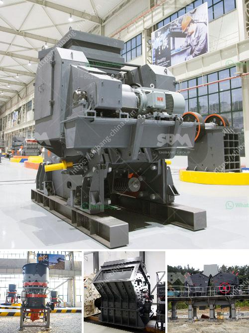

<h3>mobile quarry plant</h3>
Mobile quarry plant, also known as portable crushing plant, is a flexible and powerful crushing solution designed for small to medium-sized quarries. It offers efficient and reliable performance with an easy-to-operate control panel and a wide range of applications.

The mobile quarry plant is equipped with a primary crushing unit, a secondary crusher, screening unit, and belt conveyors. All these machines work together to form a complete stone crushing plant, empowering quarry operators to achieve high production goals. The primary crushing unit, which is usually a jaw crusher or impact crusher, is used to break large-sized rocks into smaller pieces. The secondary crusher, often a cone crusher, is then used to further reduce the size of the crushed material.

One of the key advantages of a mobile quarry plant is its mobility. The plant can be easily moved from one site to another, allowing quarry operators to take advantage of different resources or reach remote areas. This flexibility saves time and money on transportation, making the mobile quarry plant a cost-effective solution.

Furthermore, the mobile quarry plant is environmentally friendly. It is equipped with dust suppression systems and noise reduction measures to minimize the impact on the surrounding environment. This is especially important in urban areas, where strict regulations on noise and air pollution are in place.

In summary, a mobile quarry plant is a versatile and efficient solution for quarry operators. With its mobility and flexibility, it allows operators to maximize resources and reach new areas. Additionally, its environmental-friendly design ensures compliance with regulations. Investing in a mobile quarry plant can bring significant benefits to quarry operators, improving productivity and sustainability.
<h3>Contact us</h3><ul><li><strong>Whatsapp:&nbsp;<a href="https://wa.me/8613661969651">+8613661969651</a></strong></li><li><a href="https://swt.shibang-china.com/?git&amp;zhl&amp;mobile quarry plant"><strong>Online Service(chat now)</strong></a></li></ul><h3>Related</h3><ul><li><a href='europe conveyor belts manufacturer.md'>europe conveyor belts manufacturer</a></li><li><a href='domestic stone crushers.md'>domestic stone crushers</a></li><li><a href='jaw crusher supplier of new zealand.md'>jaw crusher supplier of new zealand</a></li><li><a href='coal crushing and washing plant for sale south africa.md'>coal crushing and washing plant for sale south africa</a></li><li><a href='lsx sand washing machine.md'>lsx sand washing machine</a></li></ul>