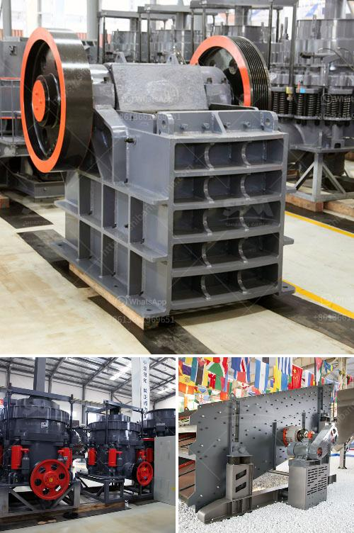

<h3>mobile screen and crushing</h3>
Mobile screens have become an essential part of our lives, serving as a gateway to the digital world. From checking emails to watching videos, and even running businesses, these screens are no less than a lifeline. However, there are times when these screens bear the brunt of our daily activities, leading to unfortunate incidents like crushing or cracking. In this article, we will explore the significance of mobile screens, the reasons behind their vulnerability, and the ways to prevent crushing or cracking.

The advent of smartphones revolutionized the way we communicate and access information. Gone are the days of bulky phones with monochrome screens; instead, we now have sleek devices with high-resolution displays that can perform numerous tasks. Mobile screens are not only our means of communication but also our source of entertainment, productivity, and connectivity. From sending quick text messages to capturing special memories, our smartphones have become an integral part of our lifestyle.

Unfortunately, despite their immense importance, mobile screens are prone to crushing and breaking due to various reasons. The main reason behind this vulnerability lies in the fragility and sensitivity of these screens. Most smartphones feature thin, delicate screens that are made of sensitive materials like glass or plastic. These materials, although designed to be durable, can be easily damaged by accidental drops, impacts, or pressure.

Accidental falls are the most common reason for a mobile screen to crack. With the hustle and bustle of our daily lives, it is easy to fumble or drop our smartphones, resulting in a damaged screen. Additionally, sitting or placing heavy objects on your phone can exert pressure on the screen, leading to cracks or even worse - total crushing.

In order to prevent such mishaps, it is essential to take preventive measures. Firstly, investing in a good protective case for your smartphone is crucial. A sturdy case can absorb shock and provide a cushioned layer of protection in case of accidental falls. Additionally, screen protectors made of tempered glass or high-quality plastic can add an extra layer of defense against scratches and cracks.

Another aspect to consider is being mindful of where you place your phone. Avoid leaving it on the edge of a table or any elevated surface where it can easily fall. Furthermore, avoid placing heavy objects on top of your smartphone, as the added weight can lead to screen damage over time.

Lastly, it is important to handle your smartphone with care. Avoid gripping it too tightly or with force, as excessive pressure can cause the screen to crack. Be cautious while cleaning the screen, using a soft cloth or a specialized screen-cleaning solution, as abrasive materials can leave scratches on the surface.

In conclusion, mobile screens have become an indispensable part of our lives, and their vulnerability to crushing or cracking cannot be ignored. Due to their delicate nature, accidental falls, pressure, or even mishandling can lead to unfortunate damage. However, by adopting preventive measures such as using protective cases, screen protectors, and handling your smartphone with care, you can minimize the risk of crushing or breaking your mobile screen. Remember, prevention is always better than a costly screen repair or replacement.
<h3>Contact us</h3><ul><li><strong>Whatsapp:&nbsp;<a href="https://wa.me/8613661969651">+8613661969651</a></strong></li><li><a href="https://swt.shibang-china.com/?git&amp;zhl&amp;mobile screen and crushing"><strong>Online Service(chat now)</strong></a></li></ul><h3>Related</h3><ul><li><a href='jual stone crusher portable.md'>jual stone crusher portable</a></li><li><a href='cebu supplier of disposable jaw crusher.md'>cebu supplier of disposable jaw crusher</a></li><li><a href='grinding machine activated carbon.md'>grinding machine activated carbon</a></li><li><a href='how much does gold mining licences in nigeria.md'>how much does gold mining licences in nigeria</a></li><li><a href='production line for calcium carbonate.md'>production line for calcium carbonate</a></li></ul>